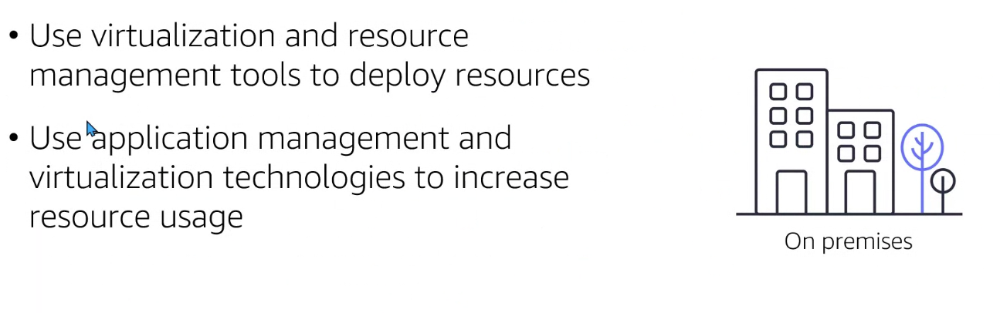

# Module 1: Introduction to Amazon Web Services

- 3 mododelos de despliegue
- 6 benficios del despligue en la nube

## Modelo cliente servidor

El cliente solicita algo y el servidor responde (resp correcta, error, etc...)

  

## Cloud computing

Surge para suplir una necesidad en las compañías respecto a la inversión en recursos para el despliegue de sus productos. Comprar una infraestructura conlleva, a parte del gasto y mantenimiento, distintos riesgos: falta de recursos o exceso de recursos. Con el cloud computing podemos disponer de los recursos precisos.

  

- El cloud computing nos permite tener servicios bajo demanda y por el tiempo justo que necesitemos
- Paga a final de mes lo que hayas empleado y lo que no se emplee se deja de emplear
- Existen multitud de recursos que podemos disponer bajo dedamnda en AWS (más de 5000)

## Modelos despliegue

1. Cloud Native o cloud based(en la nube): todos los componentes estarán en la nube. Es posible trasladar las herramientas `on premises` a la nube.

  

2. On premises (en los data center de la compañía)

Se basa en herramientas de virtualización. También llamados `private cloud deployment`.

  

3. Hybrid (mezcla de los dos anteriores)

  

Es posible que por motivos contractuales parte de los datos de nuestros datos o aplicaciones `deban permanecer en un data center on premises` (y combinar con una aplicación desplegada en la nube que consume información de nuestro data-center).

## Cloud computing benefits

1. Evitar gastos por adelantado (aunque existe bajo las 3 modalidades de pago de AWS: in advanced, partial & monthly)
1. Gastos variables (paga sólo por los recursos que emplees)
1. No hay gastos de mantenimiento en los datacenter y ni desplazamientos físicos (todo desde la consola de AWS)
1. Focus en aplicaciones y clientes
1. Reducción de la incertidumbre con respecto al cálculo de la capacidad de la infraestructura para el consumo y funcionamiento de nuestras herramientas
1. Escalabilidad (hacia arriba o hacia abajo) en función de las necesidades
1. Economías de escala: el pago de recursos va en relación al consumo de recursos (cuanto más se emplee el servicio, más económico puede llegar a ser)
1. Velocidad y agilidad: con los datacenter puede haber tiempos de espera entre la adquisión de recursos físicos, disposición de los mismos, desplazamientos de los trabajadaores, mantenimientos, preparación y confirguración... Con el cloud computing hay `minutos` entre la solicitud de recursos y su disposición.
1. Global in minutes: deespliegue rápido de aplicaciones a nivel mundial. Desde la rápida adquisición de dominios hasta el empleo de la intraestructura global de AWS (lo que permite latencia mínima si empleamos recursos geográficamente cercanos al cliente).

## AWS Core Services Categories

  

- `Compute`
- `Networking and Content Delivery`
- `Storage`: Almacenamiento (objetos, archivos y bloques)
- `Database`
- `Security, Identity and Compliance`: directrices de seguridad marcadas por cada compañía, por ejemplo (políticas, roles, usuarios...)
- `Managment and Governance`: Revisión de consumo de recursos (si son eficientes, si sobran recursos, si faltan rescursos, etc)

## Questions

- Question 1

  

- Question 2

  

- Question 3

  

