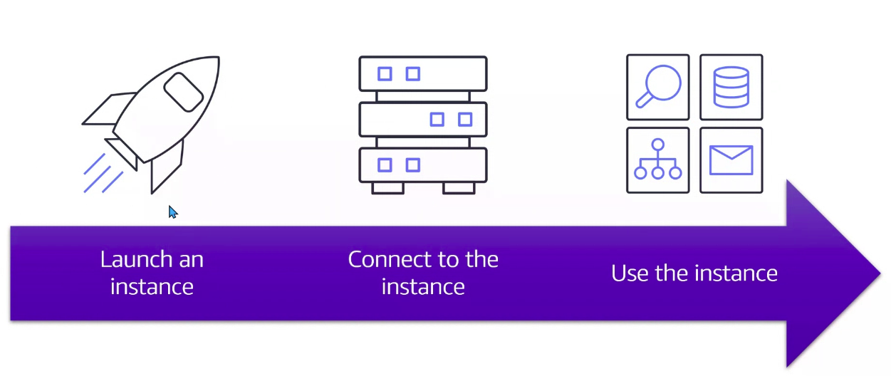

# Module 2: Compute in the Cloud

  

`Amazon EC2`: Amazon Elastic ComputeCloud.

Son máquinas / instancias / servidores que provee AWS con diferentes características en las que podemos instalar distintas aplicaciones bajo distintos SO.

- Seguro y con capacidad ajustable
- Lanzar máquinas en minutos
- Pagar sólo por lo que empleamos

## ¿Cómo funciona?

1. Lanzamos una instancia
1. Nos conectamos a dicha instancia (SSH, escritorio remoto...)
1. Uso de la instancia (configuración, subir archivos...)

  

## Tipos de instancias en EC2

  

Una `aplicación monolítica` (o altamente acoplada) hace de todo (recibe peticiones, responde, ejecuta test...). Frente a esta práctica debemos emplear:

- `Bajo acoplamiento`: cada sistema o aplicación responde por una aplicación específica (aplicaciones altamente especializadas)
- `Alta cohesión`: las aplicaciones son responsables de sus acciones

1. `General propouse`: Máquinas dónde desplegaremos aplicaciones de común acceso, por ejemplo. Estas máquinas ofreceran recursos similares entre RAM y CPU.
2. `Compute optimized`: Máquinas con mayor CPU (cómputo) y menor RAM. Por ejemplo, emplear una ETL.
3. `Memory optimized`: Máquinas con mayor RAM (procesamiento) y menor CPU. Ideales para bases de datos con gran rendimiento. Por ejemplo, BBDD con Memcached y Redis. Cuando una bbdd con Oracle, por ejemplo, que recibe 100.000 peticiones de 4 aplicaciones distintas puede llegar a saturarse o consumir demasiados recursos. En este momento añadiríamos una capa de Memcached y Redis: bbdd con caché más rápidas que, de poseer la info buscada evita el consumo sobre orable.

  

4. `Accelerated computing`: Ofrece un alto proceso de rendamiento. Emplan tarjetas de vídeo (I.A, cryptocurrency...).
5. `Storage optimized`: Optimizadas en almacenamiento dónde gran cantidad de información que sale y entra de la app, como por ejemplo un warehousing.

  

## Pricing options

1. `On Demand`: Se paga cuando la máquina está encendida. Ideales para acciones de corto tiempo como tests. Caras con respecto a otras máquinas (mejor no tenerlas encendidas 24/7).
2. `Spot`: Necesitamos emplear cierta capacidad de cómputo por un período más prolongado (hasta 6 horas). Su consumo funciona como una puja en AWS. Opción más económica (hasta el 80% descuento) que la opción on-demand.

  

3. `Reserved`: Para una web de una compañía, por ejemplo, dónde una aplicación debe estar funcionando 24/7 durante 1-3 años. Adquirimos una máquina entre 1 y 3 años. Los costos se reducen (70%-80% descuento) frente a la opción on-demand. Ideal para aplicaciones nuevas.

4. `Compute Saving Plan`: Similar a un modelo de suscripción. 100 USD al año que reportan precios más económicos al adquirir una máquina on-demand o cualquier otro producto (entorno 70% descuento). Compromiso de 1-3 años. Ideales para cargas de trabajo importantes por un perído de tiempo prolongado. Contratar este plan es ideal cuando exite un histórico de carga de trabajo en nuestras aplicaciones. Ello conlleva un compromiso de adquisión de tiempo y recursos.

  

5. `Dedicated instance`: Adquirimos en AWS un servidor dónde existe exlusividad de recursos en el servidor (no compartido) y siempre ubicado en el mismo lugar (auqnue apaguemos o reiniciemos el servidor). Costo elebado.

6. `Dedicated host`: En lugar de hacer referencia a una parte concreta del servidor se adquiere todo el servidor físico de AWS. Costo elebado: opción más cara.

  

Ver [enlace](https://calculator.aws/#/).

## AutoScaling

`El aumento o disminución de recursos con base a la demanda`. En casos de incrementación de la demanda es posible escalar la capacidad de computing y requirements.

  

Tres tipos de auto escalamiento:

1. En base a `métricas on demand` definidias en las instancias EC2
2. En base al `tiempo`. Por ejemplo, dado el histórico de nuestra empresa sabemos que los días 1 de cada mes aumenta el consumo. Es decir, los recursos pueden programarse con antelación en base a predicciones.
3. `Machine Learning / Inteligencia Artifical`. El sistema toma el histórico del comportamiento y determina la cantidad de recursos que puede necesitar en el futuro.

Definición de auto scaling:

  

1. Definimos capacidad `mínima` de instancias
1. Definimos capacidad `deseada` de instancias
1. Definimos capacidad `máxima` de instancias

## Load balancing

Componente que distribuye la carga de tráfico a través de todos los recursos disponbiles. Provee un único punto de entrada dónde el user accede y el baleanzador redirige a una u otra instancia:

  

## Questions

1. Remover instancias cuando no se necesitan: Autoescaling
1. Añade una segunda instancia durante un pico de popularidad: Autoescaling
1. Distribuye la carga de trabajo entre varias máquinas EC2: Elastic Load Balancing
1. Asegurar de que una sola instancia no tendrá toda la carga de trabajo: Elastic Load Balancing
1. Automatizar y ajustar el número de instancias EC2 para responder a la demanda: Autoescaling
1. Provee un único punto de contacto de todo el tráfico a un grupo de autoescalamiento: Elastic Load Balancing

## Notification Service

Frente a una aplicaicón monolítica debemos emplear una estructura de microservicios con bajo acoplamiento y alta cohesión.

  

Para esta transición tenemos:

- `Simple Notification Service` (SNS): nos permite enviar notificaciones push, sms, emails... a un número ilimitado de suscriptores.
- `Simple Queue Service` (SQS): Send, Store, and receive messages between software components. Servicio de colas de mensajería. Se encolan los procesos que permite acciones simultáneas de multitud de usuarios. Por ejemplo, al comprar un producto en Amazon no se ejecuta el cargo sino que se nos pone en cola junto con todos los usuarios del mundo que están comprando el mismo producto.

  

## Serverless compute services

Centrarnos en el código sin dedicar recursos a pensar en servidores:

  

`AWS Lambda`: fragmento de código dónde AWS nos provee de los recursos necesarios para la ejecución del mismo. Pagaremos sólo por el timepo que tardó en ejecutarse el código. No es necesaria la contratación de una máquina. Su proceso de funcionamiento es el siguiente:

  

## Containers

`Aplicaciones contenerizadas`: Anteriormente se empleaban máquinas virtuales, con un coste elebado en relación al peso en disco duro. Las aplicaciones contenerizadas solo dispone de los recursos precisos de cada una de las mismas (sin SO, por ejemplo, pero sí sus librerías para funcionar) y pueden duplicarse según nuestras necesidades.

  

- `Amazon ECS`: Amazon Elastic Container Service, dónde estas aplicaciones serán facilitadas por EC2 y permite ejecutar y escalar aplicaciones.

- `Amazon EKS`: Amazon Elastic Kubernetes Service, donde emplearemos Kubernetes como orquestador de aplicaciones.

  

- `AWS Fargate`: empleabes en ECS y EKS. Nos permite despreocuparnos en términos de instancias de aplicaciones en los servidores pertinentes y solo el tiempo que hayamos empleado los mismos.

  

