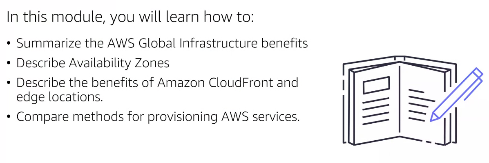
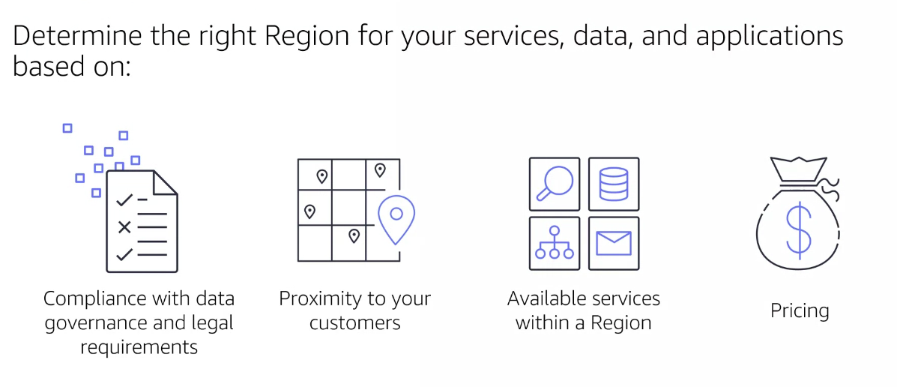
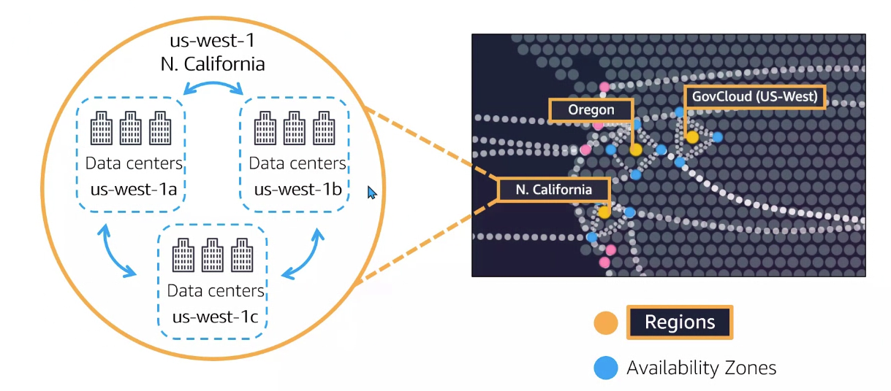
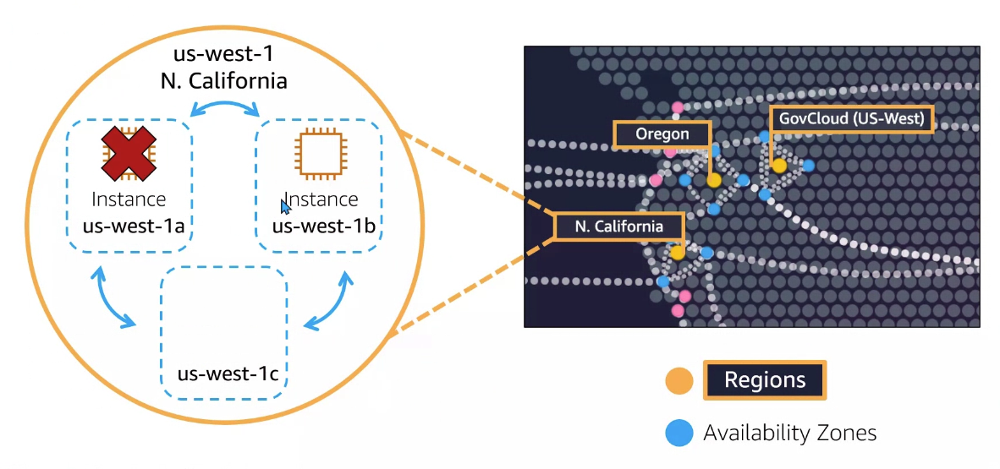
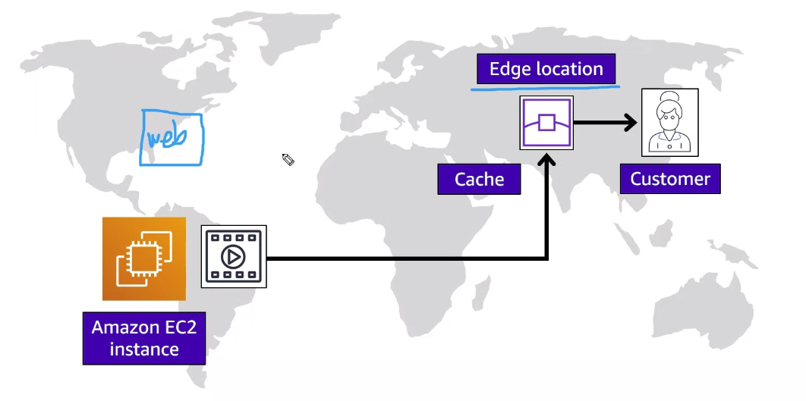
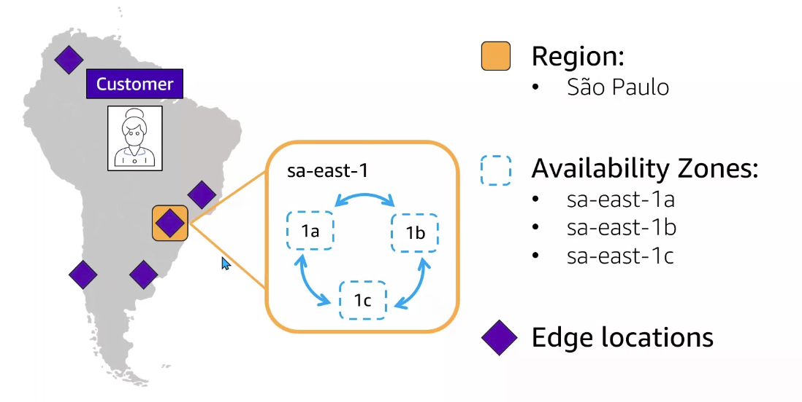

# Module 3: Global infraestructure and Reliability

  

- `Regiones`: Conjunto de una o más de zonas de disponibilidad. Se trata de una ubicación física donde se agrupan los centros de datos. Cada región de AWS consta de varias zonas de disponibilidad aisladas y separadas físicamente dentro de un área geográfica.
- `Zona de disponibilidad (AZ)`: Conjunto de uno o más de datacenter interconectados entre sí con conexiones de baja latencia que posee AWS para proveer servicios y soluciones

## Select a Region

1. Verificar si los datos de mis usuarios pueden ser llevados al extranjero en la nube.
1. Proximidad de los usuarios finales con respecto a la región donde desplegar los recursos.
1. Verificar que los servicios deseados existen dentro de la región elegida.
1. Precio

  

  

Ver [regiones disponibles](https://aws.amazon.com/es/about-aws/global-infrastructure/regions_az/?p=ngi&loc=2).

## Instancias in multiples AZs

Las instancias pertenecen a una AZ. `Emplear siempre mínimo deberemos emplear 2 zonas de disponiblidad para nuestras instancias`.

  

## Global content delivery

Es `muy importante la distanicia con el cliente final`: a mayor distancia con la región, mayor latencia.

## CloudFront

Cachear información de manera temporal para que los usuarios puedan consumir información sin latencia. Estaríamos hablando de una red global de entrega de contenido.

`Edge location`: utilizar ubicaciones o datacenters para almacenar la información durante un tiempo límite. En el sigueinte ejemplo, nuestra web ubicada en EEUU no vale la pena duplicarla en otra región sino que estableceramos una redirección a un edge location:

  

## Outpost

Los recursos de amazon pueden ser instalados (alquilando) en los datacenter on premises del cliente final. Por ejemplo, cuando una empresa necesita tener control físico sobre los recursos. De igual manera, los recursos se administrarán en la consola de AWS. Extenderíamos la infraestructura y servicios de AWS a nuestros on-premises datacenter.

## AWS Global Infraestructure

  

## Interact with AWS services

Todo se ejecuta a través de acciones / peticonoes / request. En AWS existen diferentes API dónde hay disponibles multiples peticiones a las que podemos acceder mediante:

- AWS Managment Console
- AWS Command Line Interface (AWS CLI)
- SDK (por ejemplo desde una función Lambda)
