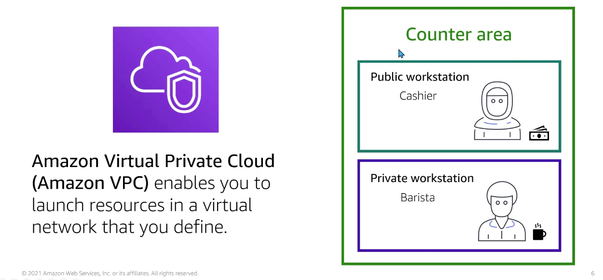

# Module 4: Networking

  

## Amazon Virtual Private Cloud (Amazon VPC)

VPC es una nube privada virtual en la que colocar los recursos y que puede ser configurada para que nadie pueda acceder a los recursos (una bbdd privada, por ejemplo).

Amazon Virtual Private Cloud (Amazon VPC) nos permite establecer una red virtual incluyendo la ubicación de los recursos (como instancias de EC2), la conectividad y la seguridad.

  

Una subnet es una sección en una VPC dónde podremos establecer grupos de recursos. Hay de dos tipos:

- `Public workstation` es la subred publica dentro de la VPC
- `Private workstation` es la subred privada dentro de la VPC

  

Los usuarios, a través de internet, sólo podran contactar con la public workstation, nunca con la private workstation (pero si puede haber comunicación entre la public y private).

Por ejemplo, un usuario externo sólo podrá hacer request a las instancias a las VPC mediante internet, nunca a la private subnet.

`Internet gateway`: Es una Puerta de enlace que permite comunicar la VPC con internet.

Podemos crear esta herramienta en la cuenta de AWS y estará asociado a una VPC. Cuando queremos que ciertos recursos de la VPC sean públicos deberemos crear una internet gateway. Si no creamos una internet gateway, a través de internet no se podrá acceder a los recursos.

  

`Virtual private gateway`: Permite conectarnos a una private subnet mediante una VPN, por ejemplo, desde un datacenter on-premises:

  

`(NAT) Network Address Translation (NAT)` o servidor de salto: si necesiamos actualizar una red privada podremos redifigir al NAT de la public subred, está actualizará la información o paquetas y el mismo NAT devolverá la informaión a nuestra privet subnet.

  

## AWS Direct Connect location

Cuando la empresa está obligada a tener ciertos recursos privados, dónde no puede haber conexiones al datacenter sin internet (ni siquiera VPN). Para ello se empleará un `AWS Direct Connect location`.

Una `VPN` es una red privada virtual que nos permite obtener una extensión segura de una red local, sobre una red pública o no controlada.

Estas conexiones son totalmente privadas y permitirarán conectar, a través de nuestro proveedor de internet, la última milla de cable de fibra con una velocidad de entre 1gb y 10gb. La conexión es directa con el datacenter.

  

## Questions

- Datadabes aisladas que contienen información privada de los clientes: private sudred
- Crear una conexión VPN entre la VPC y la red corporativa privada: Virtual private gateway
- Recursos para consumo de cliente (aplicación web): Public subnet
- Establecer una conexión dedicada entre la data on-premise y la VPC: AWS Direct Connect

## Network traffic in a VPC

`Firewall`: servicio administrado que facilita la implementación de protecciones de red básicas para todas sus Amazon Virtual Private Clouds (VPC).

## Network access control list (ACL)

La ACL define qué Cuentas de AWS o grupos cuentan con acceso y el tipo de acceso que tienen. Cuando se recibe una petición desde internet se verifica que el puerto empleado (puerto 80, por ejemplo), esté definido como una regla en el ACL. El ACL define reglas de entrada y salida.

  

  

## Filtrado de paquetes stateless

La salida debe estar establecida en el ACL: se debe definir un puerto de entrada y uno de salida (regla de entrada y salida). Si no son el mismo puerto habrá inconsistencias en el servicio.

  

## Security groups

`Firewall que existe a nivel de instancias`. Establecemos el puerto de entrada que escucha en la instancia y, tras ejecutar el procesado, devuelve respuesta por el mismo puerto. En el security group esablecemos solo una regla de entrada, las reglas de salida son, por defecto, el mismo puerto por el que entró.

  

  

## Questions

- Access control list (ACL) son firewalls para subnets. Establecen un filtrado de paquetes stateless.

- Security groups son firewalls para las isntancias de EC2. Establecen un filtrado de paquetes stateful.

## Domain Name System

Resolver nombres de dominio sin necesidad de conocer el número de IP específico de un site:

  

## Amazon Route 53

`Amazon Route 53 es un servicio de DNS (sistema de nombres de dominio)`. Está diseñado para ofrecer a los desarrolladores y las empresas un método fiable y rentable para redirigir a los usuarios finales a las aplicaciones en Internet mediante la traducción de nombres legibles para las personas como www.ejemplo.com en direcciones IP numéricas como 192.0.2.1 que utilizan los equipos para conectarse entre ellos.

Amazon Route 53 conecta de forma efectiva las solicitudes del usuario con la infraestructura en ejecución en AWS, como instancias de Amazon EC2, equilibradores de carga de Elastic Load Balancing o buckets de Amazon S3. Además, puede utilizarse para dirigir usuarios a infraestructuras externas a AWS.

  

Por ejemplo, si un cliente accede a una aplicaicón. El cliente no sabe si está en una instancia, un baleanzador, etc. Cuando se ejecuta la acción (accede a www.domainname.com)) el routa 53 resuelve y redirige.

  

