# Module 5: Storage and Databases

  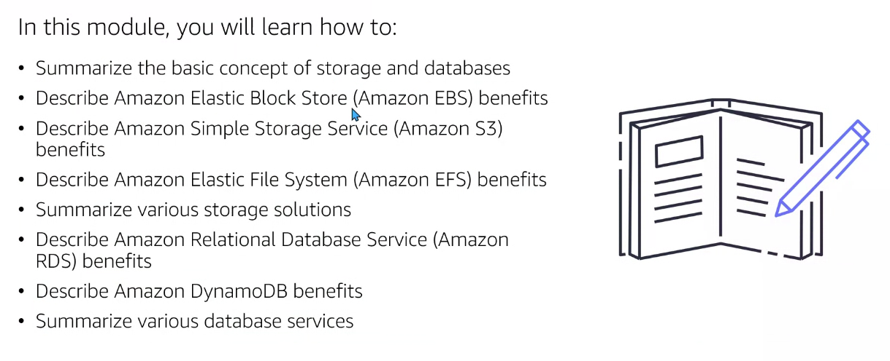

## AWS Storage

Existen 3 tipos de almacenamiento. No sólo en Amazon sino que es un estándar en el mundo cloud:

- `Almacenamiento en Bloques o EBS`: En un disco duro físico. Títipco de e-commerce.
- `Almacenamiento de Objetos`: S3. Similar a un dropbox: vídeos, archivos, música...
- `Almacenamiento de Archivos`: EFS o FSx. Disco duro en red. Archivos de una compañía que requieren constante edición. Cuando necesitamos compartir archivos internamente, editar los archivos, los arhcivos a compartir son de carácter privado.

  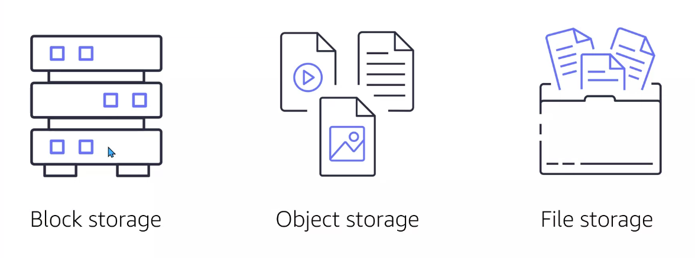

## Almacenamiento en Bloques

Almacenamiento en bloque se emplea con las instancias EC2:

  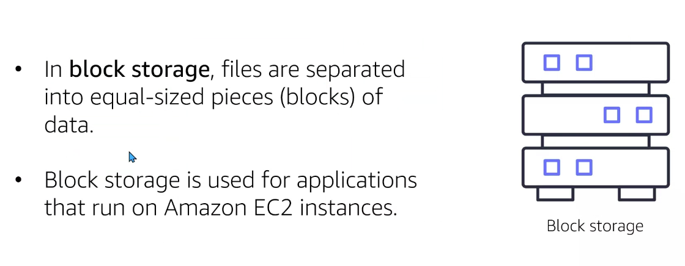

## Instance Store

Disco duro para almacenar información temporal. Por ejemplo, se puede emplear para ETL (transformación y limpieza de datos desde un werehouse).

  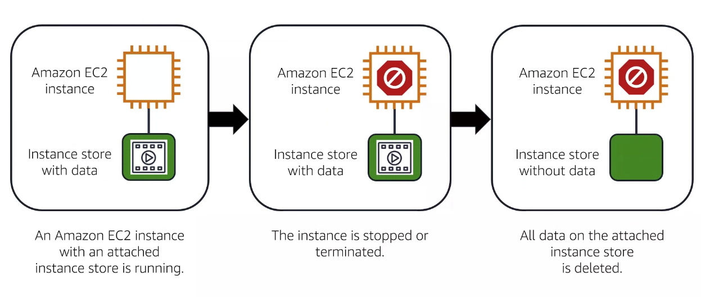

## EBS volumens

Almacenan información de carácter persistente.

  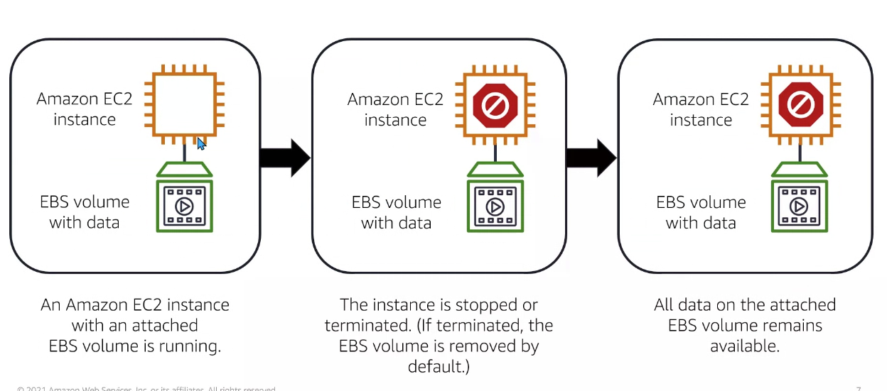

## EBS snapshots

Son backups incrementales de los datos almacenados en un EBS.

Creación de backups de nuestros discos duros EBS (cuya información es de carácter persistente) para que podamos reestablecer información en otra máquina.

Es posible establecer políticas de configuración para la reación de los mismos snapshots (diario, mensual...). Los snapshots consecutivos "reutilizan" la información guardada en el anterior snapshots y le añadimos la nueva información.

De ahí su nombre: discos duros basados en bloque.

  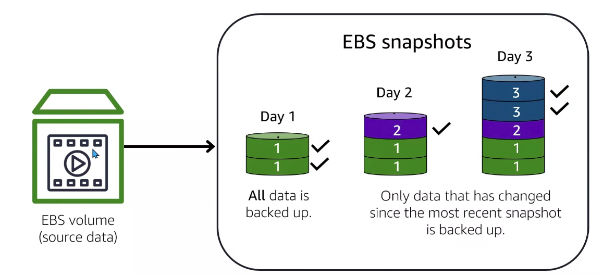

## Questions

- `Instance store`: almacenar información temporal
- `EBS`: persistencia de datos en el tiempo

## Objets storage on Amazon Simple Storage Service (Amazon S3)

S3 es un servicio de almacenamiento de objetos teniendo como característica principal que el acceso a los datos es frecuente y rápido.

Cada objeto consiste de una data, metadata y key. Una analogía podría ser dropbox: carpetas que almacenan distinta información. Todo ello recibe el nombre de Amazon S3. Estos poseen hasta 3 replican en la misma región. Si queremos replicar a otra región a mayores, debemos configurarlo.

  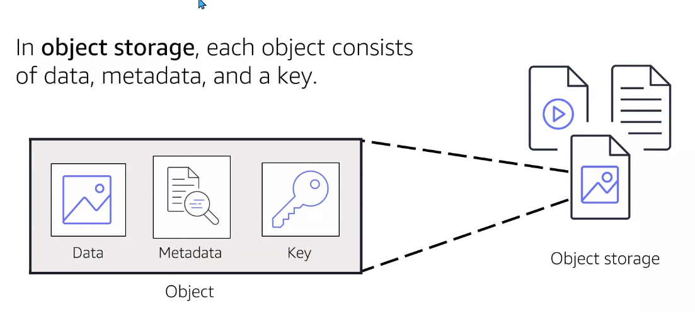

Amazon Simple Storage Service (Amazon S3) es un servicio de almacenamiento de objetos.

  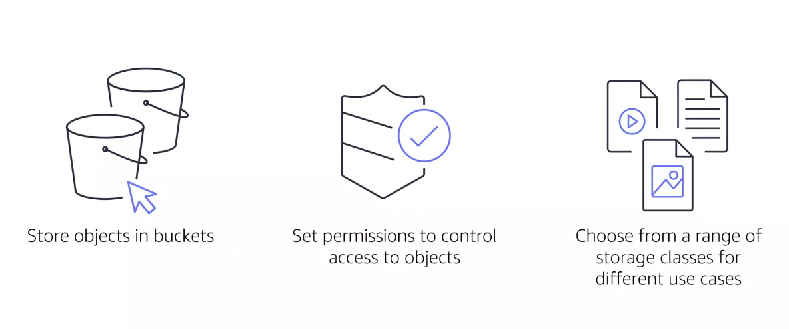

- Los buckets deben tener un nombre únicos.
- Establecemos permisos para cada usuario y sus acciones a mis buckets
- Seleccionar un rango de ...

Exiten distintos modelos o capas de almacenamiento:

1. Todos los archivos guardados se almacenarán en un `S3 standar` o capa genérica. La información almacenada en una región se duplica en 3 AZ (sin coste adicional para que exista alta disponibilidad d ela info).La disponibilidad de archivos será alta.

2. `Standar IA`: almacena archivos con un precio más bajo que la S3 standar. Ideal para consulta de archivos más espaciada en el tiempo.

Ver [pricing](https://aws.amazon.com/es/s3/pricing/).

3. One Zone-IA: Para información que no pasa nada si perdemos (solo estará en una zona de disponibilidad). Información que puedo volver a generar (por ejemplo, un cierre bancario).

4. Inteligent-Tiering: Cuando no sabemos cual emplear

5. `Glacier`: puede tardar horas en devolver la info (1-2 horas), pero es económica.

6. `Glacier depp archive`: mas económica, pero se recupera la info de manera más lenta (12 horas).

La diferencia entre las mismas son los costos y el comportamiento a la hora de acceder a la información.

  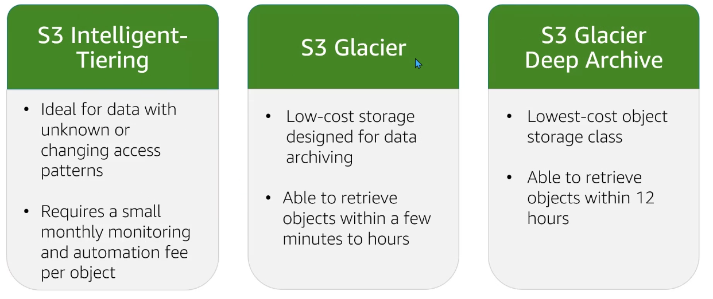

## File storage

`File storage o EFS`: acceso a nuestros archivos mediante distintas aplicaciones o servidores.

  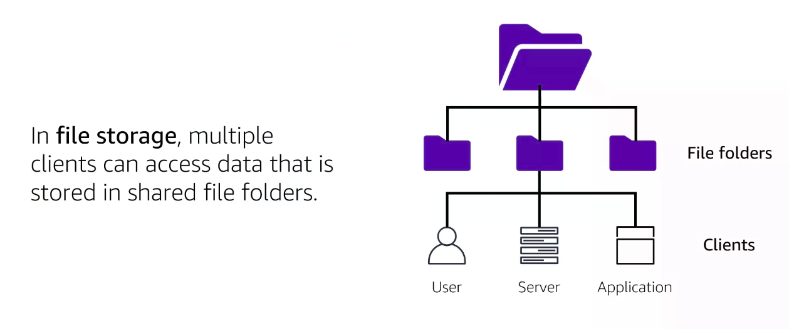

## Elastic file system

Acceso multiregional:

  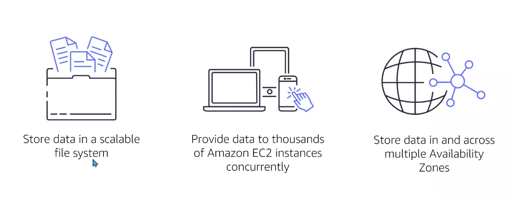

## Database types

- `BBDD relacionales`: tablas bajo la premisa entre entidad relación. Se consulta a través de SQL.
- `BBDD no relacionales`: almacena documentos (más rápidas)

  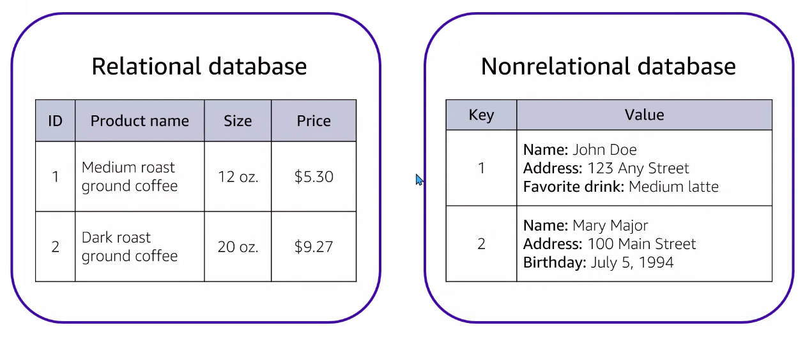

  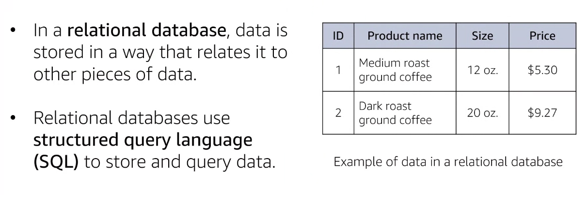

## Relational Database Service RDS

En AWS trabajamos mediante Relational Database Service las bbdd relacionales.

Existe almacenamiento en tránsito y descanso. La data está encriptada si no es esta consultando o enviando. Si la data se consume viajará encriptada.

  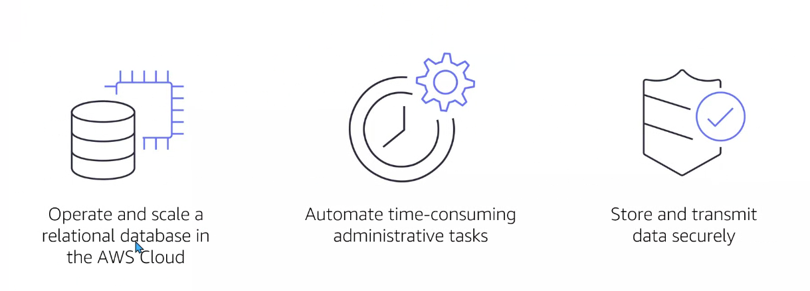

Motores soportados por RDS:

  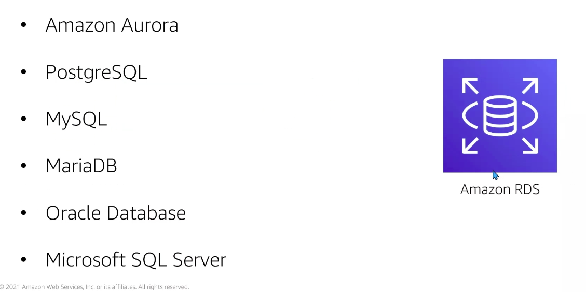

Amazon Aurora tiene 2 tipos:

- Amazon Aurora RDS
- Amazon Aurora Serverless

1. Aurora está diseñana para soporta alto tráfico de clientes (lectura y escritura) y almacenar gran cantidad de datos.

2. Se reduce el coste eliminando entrada y salida de datos superfluos.

3. Hasta 6 copias (sin coste adicional) en 3 AZ.

  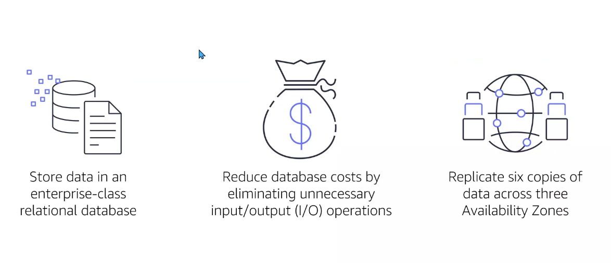

## BBDD nonrelational

BBDD dinámica de documentos con pares de key-value (id) identificables.

  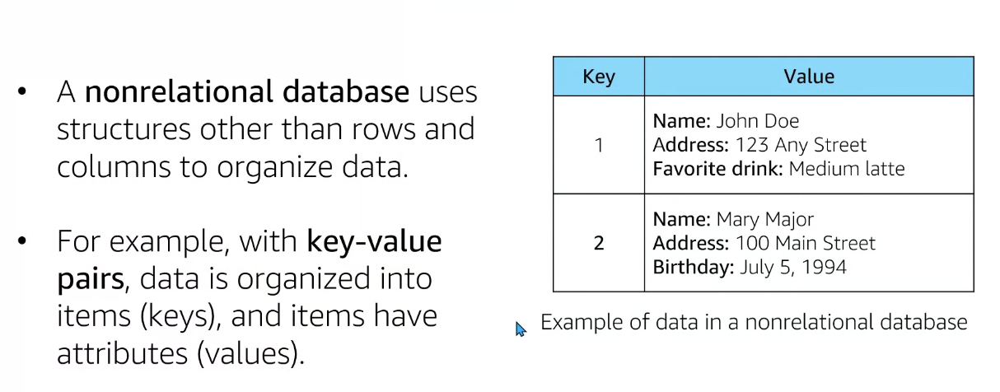

`Amazon DynamoDB` para el consumo de este tipo de bbdd:

  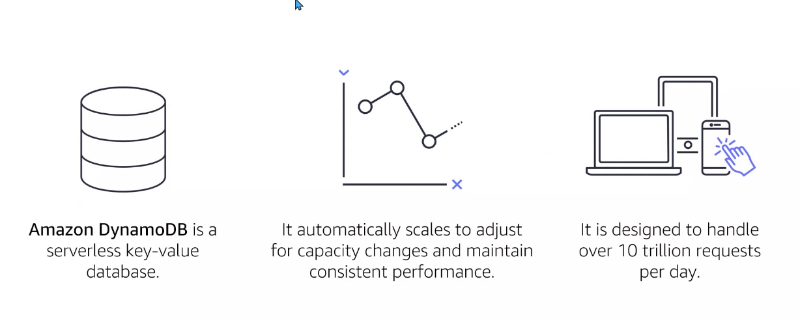

## Database Migration Service

Database Migration Service verifica la bbdd fuente, la bbdd destino y en el medio esité una EC2 que consulta la info y gestiona el traslado.

  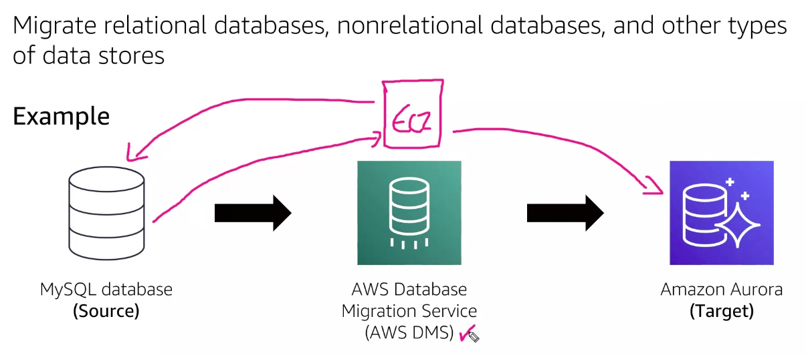

- Almacenar datos en una bbdd relacional: RDS
- Ejecutar una BBDD serverles (suele ser no relacional las serveless): Aurora o DynamoDB (mejor lo último si es no-relacional)
- BBDD orientada a key-value: DynamoDB
- Usar SQL para organizar la data: Amazon RDS
- Salcar 10 trillones de request al día: DynamoDB
- Almacenar data en una bbdd Amazon Aurora: Amazon RDS

## BBDD aditional services

`Redshift`: Para datawerehouse. Crear un almacen de datos de alto volumen.

`DocumentDB`: Si empleamos mongoDB podemos migrar nuestro sistema de bbdd no relacional

`Neptune`: bbdd orientada a grafos

`QLDB`: BBDD cuya función es registrar transacciónes de manera transparente e inalterable. Verificable a través de cryptografía. La información de esta BBDD no puede ser modificada ni manipulada (seguros, banda, RRHH...)

  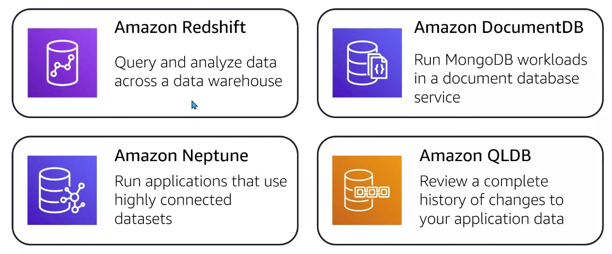

`: centralizada `:orientada a memoria
``: funciona con dynamodb: los nilisegundos de dynamodb de tiempo de consulta pasa a microsegundos.

  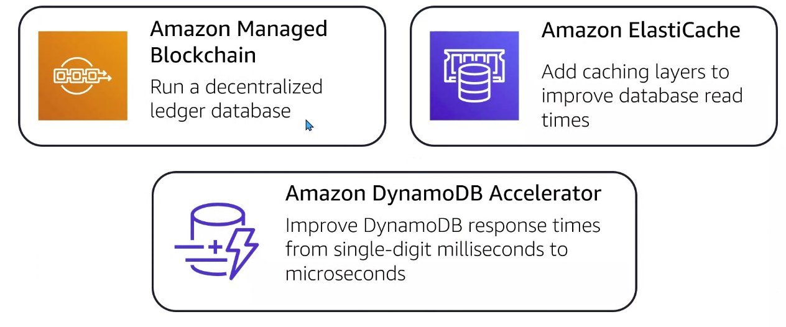

## Questions

  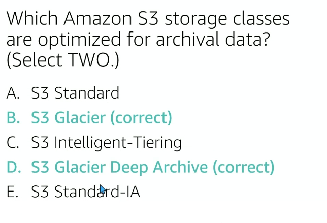

  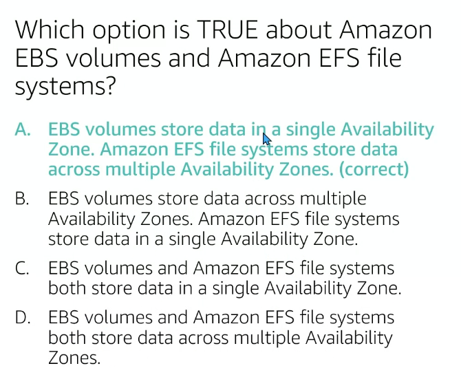

  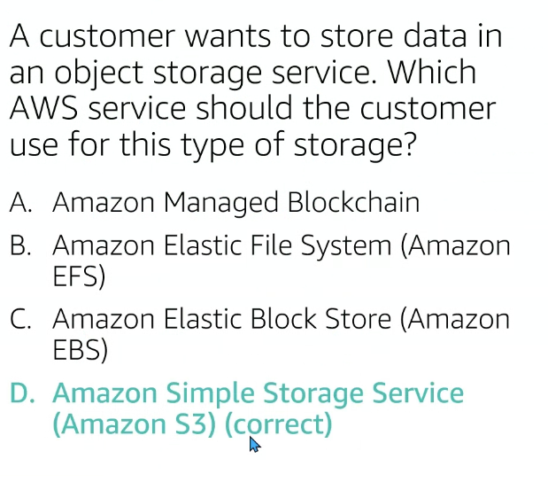

  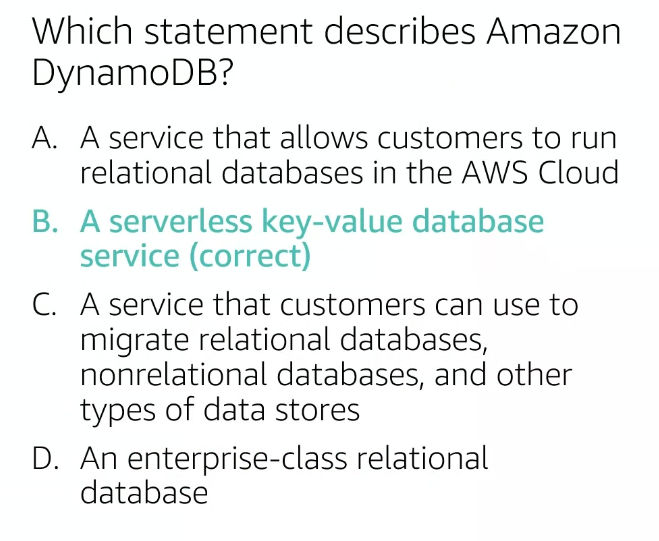

  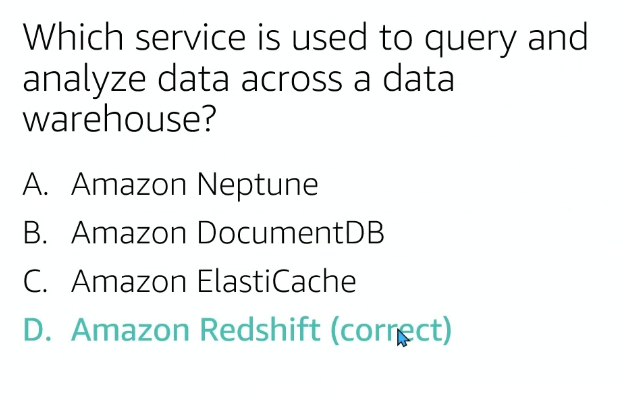

