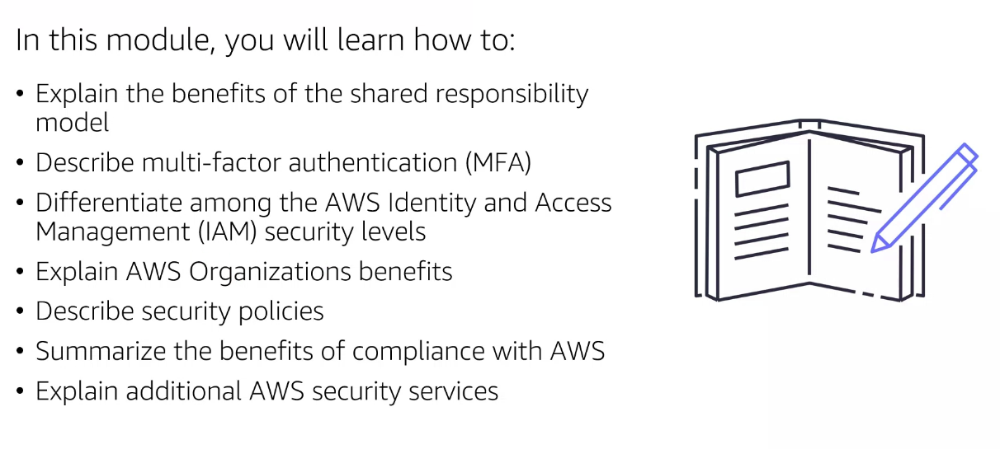

# Module 6: Security

  

## Shared responsability model

Responsabilidades de los clientes y de AWS, de manera diferenciada:

  

> Importante, conceptualmente AWS nos da una máquina y nosotros somos responsables de su configuración y seguridad.

Ejemplo de responsabilidad de cliente:

  

Ejemplo de responsabilidad de AWS:

  

## Questions

- Configurar los security groups de las instancias EC2: cliente
- Mantenimienot de infraestructura de la red: aws
- Implementar seguridad física en los datacenter: aws
- Actualizar software en las instancias EC2: cliente
- Mantenimiento de servidores que corren en instancias EC2: aws
- Establecer permisos a los objetos de S3: cliente

## AWS Identty and Access Managment (IAM)

Con AWS podemos crear usuarios y asignar permisos y políticas para determinados servicios. Por ejemplo, los developer tendrán acceso a los servicios de repositiorio de código, despliegue continuo, pruebas unitarias, etc.

// NOTE: revisar definición de IAM
IAM control de identidad y permisos.

  

- Usuarios: individuos
- Politicas: JSON donde establezco permisos y accesos
- Grupos: repositorios de usuarios (agrupación de usuarios para una mejor gestión de permisos para grupos de personas)
- Roles: permisos temporales para user que otrogan ciertas funciones de acceso. Solo un rol a la vez por cada usuario. Los servicios de AWS pueden tener un rol también. Los roles se asumen por una única persona en un concepto de política confianza.
- Multifactor authentication (AMF): user y contraseña + otro sistema de autentificación (app, dispositivos de terceros, etc)

## Account Roout User

Cuando creamos una cuenta en AWS se genera un user root. La mejor práctica es crear una cuenta administrador que cree users, servicios y delegar funciones (pero nunca usar el user root para los trabajos cotidianos). Siempre seguir la metodología del menor-permiso-posible.

  

`IAM user`: la mejor práctica es que que cada persona tenga sus propios permisos y, si es posible, agruparlos en según funciones comunes.

  

`IAM policy`: da y retira permisos para acceso a servicios para personas. La mejor práctica es asignar el menor-permiso-posible.

  

Ejemplo de política JSON IAM:

  

.
`IAM grupos`: colección de usuarios con elementos en común (son developers, QA, integración...)

  

`IAN role`: identidad otorgada para dar acceso temporal a los permisos.

  

`Multifactor authentication`: capa extra de protección para las cuentas de AWS.

  

## AWS Organizations

Ayuda a consolidar el número de usuarios, proyectos o cuentas que tengo en mi compañía. El service Control Policies (SCPs) son doc en formato JSON que nos ayudan agestionar los permisos de acceso a las cuentas dentro de mi organización. Estamos hablando de cuentas embebidas dónde solo hay una cuenta máxima responsable (empresas grandes).

  

Ejemplo del uso de SCPs. Podemos crear `unidades orginacionales (OU)`.

  

## Questions

  

## Compilance

`AWS Artifact` provee accesos y doc de seguridad a las ceritificaciones de seguridad que AWS debe respetar. Por ejemplo, certificación PSI (que AWS como compañía tenga dicha certificación no implica que mi empresa automáticamente lo tenga: ambas compañías debeán solititarlas).

  

  

## Customer Compliance Center

  

## Questions

  

## Seguridad en aplicaciones

## WAF

`Web Aplication Firewall`: las request que llegan a un servicio el waf y este verifica que la IP está o no bloqueada. En el WEF configuraremos puertso de salida y de entrada. Si queremos protegernos de accesos mediante puertos, WAF.

  

## DDoS on AWS Shiel

Ataque de negación de servicio y ataque de de negación de servicio distribuido (bots).

  

`AWS Shield` nos protege de este tipo de ataques. Integrate es gratis y Advanced es suscripción.

  

Podemos combinar Shield y WAF.

## Amazon inspector

Solo funciona en instancias EC2. Inspecciona que temas o issues de seguirdad tenemos instaladas en nuestras instancias EC2, analiza vulnerabildiades y nos dará recomendaciones sobre actualizaciones o parches.

  

## Key Managment Service

AWS KMS: ayuda a encriptar la información mediante llaves criptográficas para asegurar mis contenidos en AWS (por ejemplo, los archivos que tengo en mi S3). Además podemos gestionar que usuarios podrá crear y administrar llaves.

  

## Amazon GuarDuty

Provee recomendaciones de seguridad automáticas sobre vulnerabilidades mediante IA .

  

## Questions

  

  

  

  

  

