# Module 7: Monitoring and Analytics

  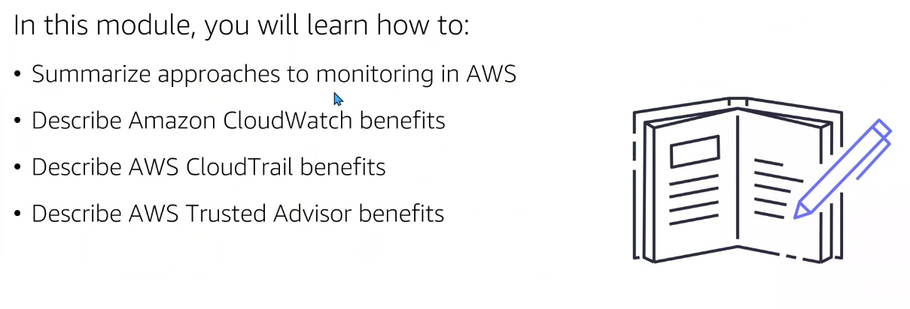

## CloudWatch

Servicio que nos permitirá `generar métricas de nuestros servicios para poder tomar acciones convenientes.` Estas métricas se ejecutarán sobre EC2, por ejemplo, para calibrar la carga de la CPU (o memoria, entrada y salida de datos en los discos duros, errores en el baleanzador de carga...).

Nosotros podemos establecer límites (thresholds) que generarán acciones:

  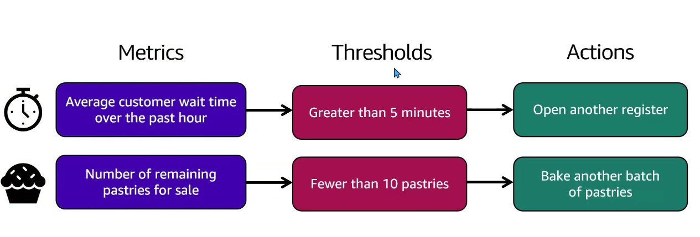

- CloudWatch nos permite monitorear una métrica de manera visual en tiempo real.
- Las métricas son accesibles desde la consola de administración y podemos agrupar las mismas si importar la región o AZ donde se encuentren.
- Nos permite configurar alertas automáticas y acciones en respuesta a dichas métricas.
- Los dashboard son customizables

  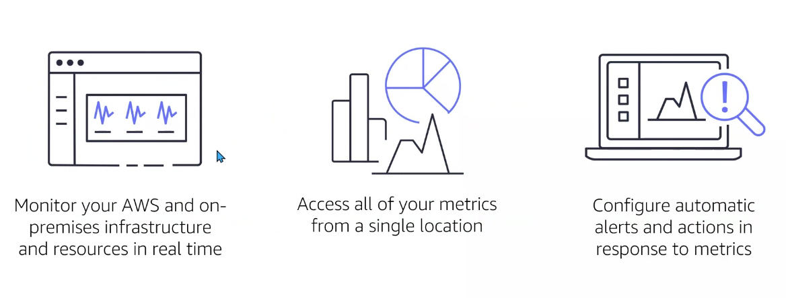

Ejemplo de cloudWatch dashnoard: métrica de transferencia de entrada y salida de datos y escritura de bytes:

  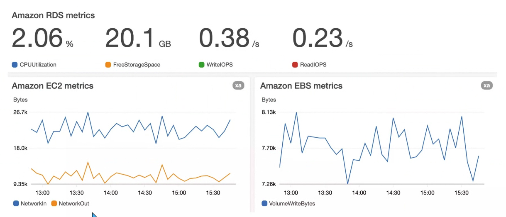

## CloudTrail

`Servicio que traquea las actividades de los usuarios por cualquier medio que acceda a AWS` (consola, CLI o SDK). Todas las acciones se traquean y almacena los logs en un bucket:

  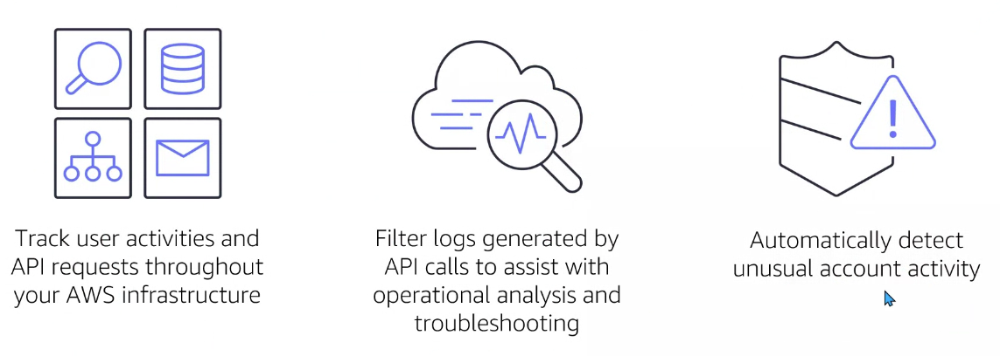

Ejemplo de CloudTrail:

  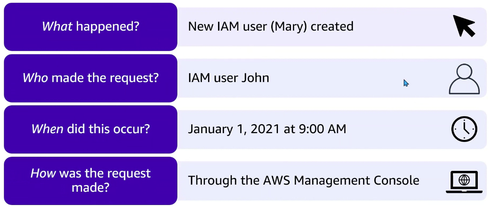

## Questions

CloudTrail: Traquear actividad de usuarios mediante API request en las insfraestructuras de AWS y filtrar logs y ayudar con un análisis operacional y dar solución a problemas.

## Trusted Advisor

`Trusted Advisor` (versión gratis y versión de pago): herramienta que da recomendaciones de buenas prácticas que estoy (o no) haciendo en mi infraestructura. Recomenddaciones en tiempo real para mejorar nuestro AWS enviroment.

  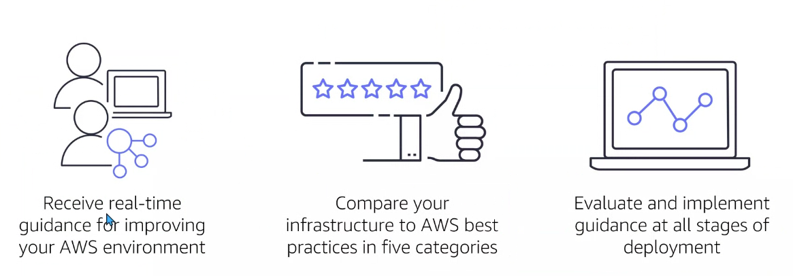

`5 categorías de Trusted Advisor`:

1. Cost Optimization (estás gastando en servicios más de lo que necesitas: puedes ahorrar)
2. Performance (rendimiento)
3. Security (tienes los puertos abiertos de los sewcurity group, por ejemplo)
4. Fault Tolerance (deberías usar 2 zonas de disponibilidad)
5. Service Limits ()

  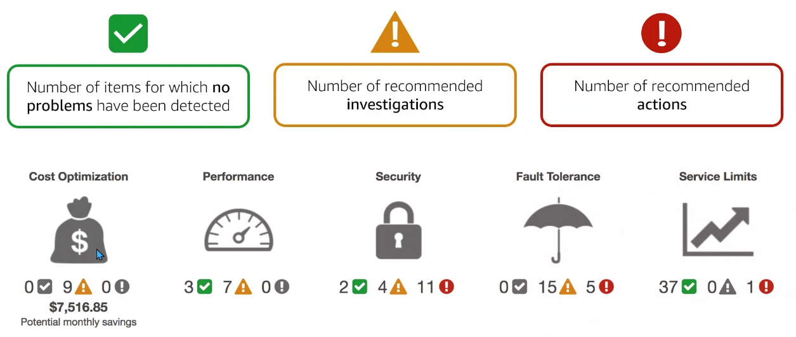

## Questions

  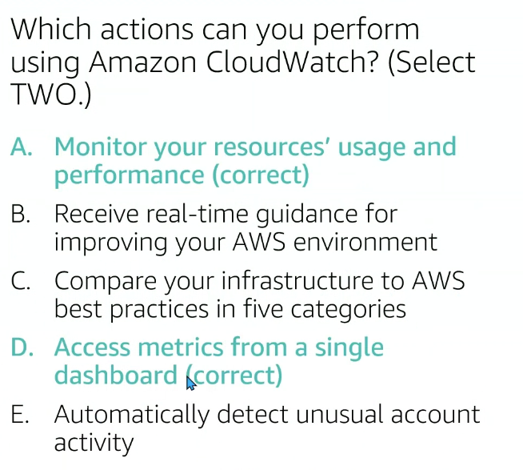

  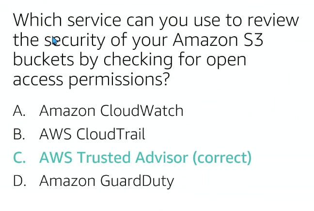

  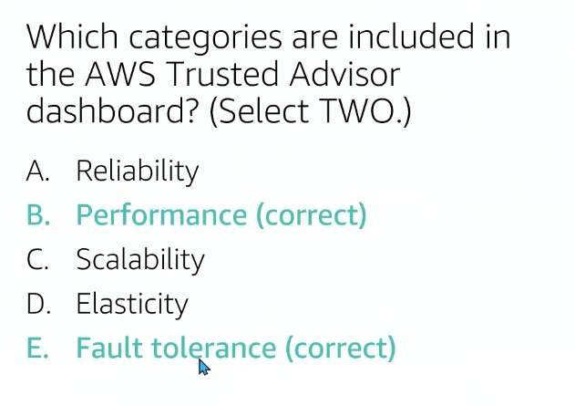

