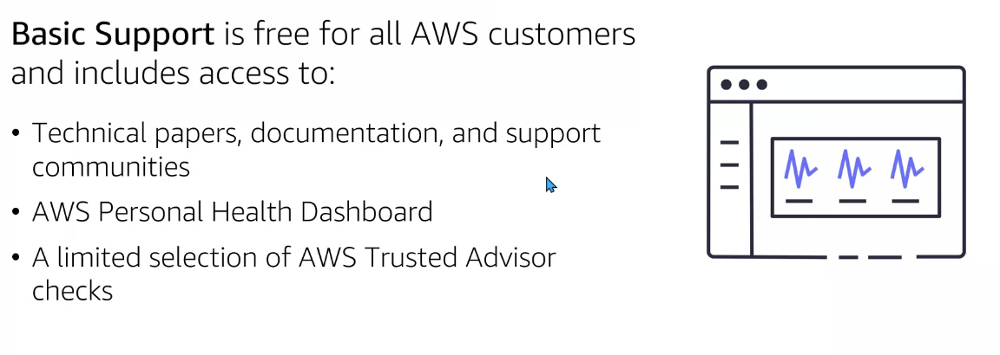

# Module 8: Pricing and Support

  

## AWS pricing and support

- How can i budget and pay for AWS services?
- Where can i find support and third-party software?

## AWS pricing

Free Tier categories: capa gratuita dónde algunos servicios serán siempre gratis, otros gratis durante 12 meses y otros de prueba:

  

[Free Tier link info](https://aws.amazon.com/es/free/?trk=5d2ba0e0-170e-469d-a64d-d84050e30e37&sc_channel=ps&sc_campaign=acquisition&sc_medium=ACQ-P|PS-GO|Brand|Desktop|SU|AWS|Core|ES|ES|Text&ef_id=Cj0KCQjw-daUBhCIARIsALbkjSZQCckNt12mf0OLd7Us7snbJMQ2i9sWk6tcmVe3SQe5NTjcfRmwHioaAqViEALw_wcB:G:s&s_kwcid=AL!4422!3!561218200746!e!!g!!aws%20gratis&ef_id=Cj0KCQjw-daUBhCIARIsALbkjSZQCckNt12mf0OLd7Us7snbJMQ2i9sWk6tcmVe3SQe5NTjcfRmwHioaAqViEALw_wcB:G:s&s_kwcid=AL!4422!3!561218200746!e!!g!!aws%20gratis&all-free-tier.sort-by=item.additionalFields.SortRank&all-free-tier.sort-order=asc&awsf.Free%20Tier%20Types=*all&awsf.Free%20Tier%20Categories=*all)

En relación al precio existen diersos conceptos. Debemos siempre docuemntarnos bien sobre los mismos.

- `Pay as you go`: pago por tiempo de uso.
- `Pay less when you reserve`: aunque luego no emplees el espacio adquirido.
- `Pay less with volume-base discount`: pagar menos por volumen (economías de escala).

  

## Lambda pricing

Se paga solo por el tiempo de uso, por el número de request y podemos ahorrar costs con un Compute Saving Plan:

  

Ejemplo Lambda service charges:

  

## EC2 pricing

  

Ejemplo EC2 service charge:

  

## Amazon S3 pricing

  

> Managment and replicant: en que capa tenemos la información: costes de gleiser, s3 frecuent access..

Ejemplo S3 service charge:

  

## Consolidate billing

Podemos recibir una factura por todas las cuentas de AWS de nuestra organización. Existe la opción de dividir la factura según proyectos. Además podemos revisar los costos asociados por cada cuenta y servicio. También es posible compartir ahorros entre las distintas cuentas de una organización.

  

  

Si se emplea distinta capacidad entre cuentas se la suma total:

  

## Budgets

AWS Budgets son presupuestos. Es una herramienta que podemos emplear para establecer límites por los usos y costes de nuestros AWS. No es posible establecer una acción que detenga la ejecución de máquinas tras sobrepasar el límite de costes. Podemos setear sistema de alerta (sms, por ejemplo).

  

## Cost Explorer

Cost Explorer es una herramienta que nos permite visualizar, analizar y gestionar los costes del uso de AWS a los largo del tiempo.

  

## Support plans

`Basic support`: gratuito que incluye papers, documentación, comunidades, soporte... AWS Personal Health Dashboard nos informa de la salud de nuestros servicios. Trested Advisor limitado.

  

Planes de soporte disponibles:

  

## AWS Marketplace

AWS Marketplace catálogo digital que nos provee distintas soluciones para nuestras necesidades.

  

  

