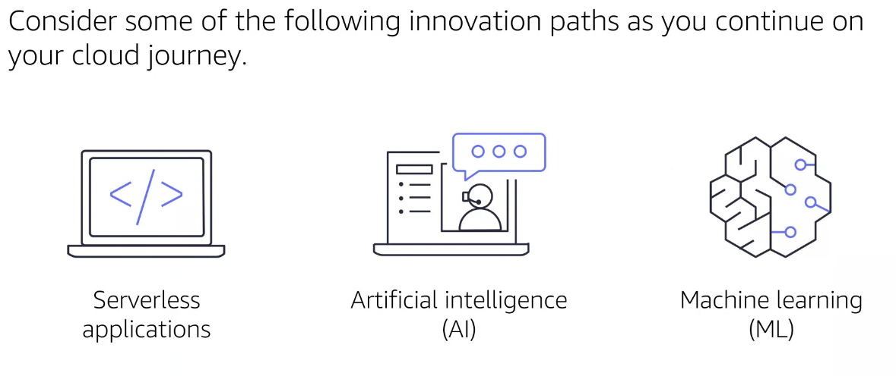
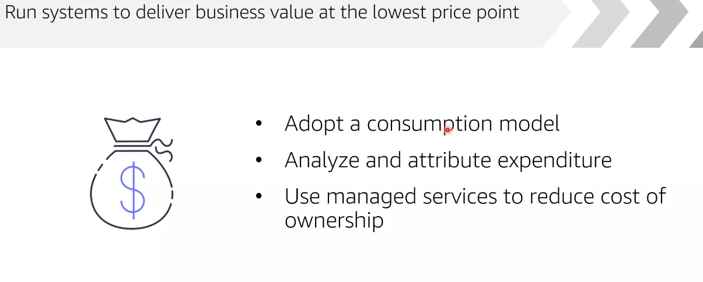

# Module 9: Migration and innovation

  

## AWS Cloud Adoption Framework

Provee de información sobre como debería una compañia transicionar a la migración a AWS. Existen 6 áreas.

  

  

- Bussiness

  

- People

  

- Governance

  

- Platform

  

- Security

  

- Operations

  

## Migration strategies (6R)

- `Retire`: La aplicación ya cumplió su funcionalidad y podemos dar el servicio de baja
- `Retain`: Aplicaciones que si o si necesitamos. Aquello que no se migra por necesidades del negocio
- `Repurchase`: Recompra de acción ofrecida por AWS. Aplicaciones que se abandonarán serán sustituidas por otras ya exixtentes en el mercado
- `Refactor/Rearchitect`: Volver a generar la arquitectura de la aplicación con las características cloud. Aplicaciones que se reharán como cloud native
- `Replatform`: Optimizaciones de la nube para tener beneficio tangible de mi aplicación. Aplicaciones que se migran actualizando la plataforma origen
- `Rehost`: Mover aplicaciones, pero sin ningún cambio. Aplicaciones que se llevan tal cual de su ubicación actual a los servicios de AWS

  

## Snow family

- `Snowcone`: 8 TB
- `Snowball device`: servidor para generar procesamiento de datos. 80TB
- `Snowmobile`: transferencia de información a nivel de petabiles 100PB

  

## Innovation AWS

Como compañía deberemos considerar:

  

Ya que AWS puede tener un servicio ya listo:

  

## Well-Architected Framework

Nos ayudará/aconsejará sobre diversas tácticas sobre las operaciones de las aplicaciones en relación a:

  

- `Ecelencia operacional`: capacidad para admitir el desarrollo y ejecutar cargas de trabajo de manera efica

  

- `Security`: capacidad para proteger los datos

  

- `Reliability`: capacidad de realizar su función de forma correcta y constante

  

- `Performance efficiency`: capacidad de utilizar recursos informáticos de forma eficiente para cumplir con los requisitos del sistema

  

- `Cost optimization`: capacidad para ejecutar sistemas para entregar un negocio al menor precio.

  

