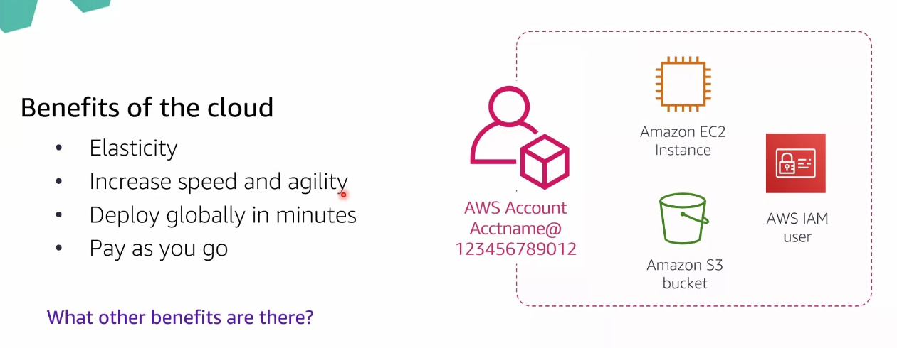

# Module 1: Security on AWS

En este módulo hablaremos sobre `principios de diseño y modelo de responsabilidad compartida`. Existen 2 tipos de problemas:

- Internos (personal de la compañía)
- Externos (ataques)

## Benefits of the cloud

- Beneficios de `servicio para clientes`.
- Beneficios `económicos`: ahorramos en gastos on-premises y pasamos a tener gastos operacionales (desgrabables en la declaración) por el despliegue de nuestras herramientas en la nube.
- Beneficios `elasticidad`: cuando la compañía necesite más recursos para suplir una necesidad (más disco duro, más CPU...) no realizará gasto (económico y tiempo) en on-premises sino que aumentará sus recursos en AWS y en minutos estarán listos. Además podemos reducir el exceso de recursos en minutos.
- `Incremento de velocidad y agilidad`: podremos aumentar nuestros recursos de manera ágil y rápida.
- `Global`: despliegue global de nuestras aplicaciones en minutos a nivel mundial. La compra de dominios se berifican y estarán disponibles en minutos.
- `Pay as you go`: pagamos sólo por lo que empleamos.

  

Por todo ello debemos proteger nuestros servicios mediante:

- `Controllability` / Control: control de nuestros recursos
- `Auditability` / Auditoría quién hace qué dentro de la compañía
- `Visibility` / Visibilidad: quién puede ver qué recursos
- `Agility` / Agilidad: emplear cualqueir recurso con rapidez. No necesario emplar todos los recursos disponibles en AWS: podemos autorizar o restringir componentes que emplearemos en nuestra compañía
- `Automation`/ Automatización: Automatizar procesos internos en AWS (montar una insfraestructura de 3 servidores, por ejemplo, puede hacerse mediante procesos automatizados)

  

## Principios de seguridad

1. Aplicar siempre el principio de menor privilegio: Es otorgar a los usuarios solo los privilegios esenciales para que puedan realizar sus funciones. Nunca más de lo que en estos momentos necesita. Por ejemplo: un permiso de sudo nos permitirá realizar nuestro trabajo como developer, pero es más de lo que necesitamos y podemos exponernos a problemas de seguridad.

  

2. Habilitar trazabilidad (relacionado con la auditoría) mediante Cloud Trail

  

3. Seguridad en todas las capas mediante distintas herramientas:

- Security groups: firewall que existe a nuvel de instancia (definición de puertos, por ejemplo)
- NACLs: Network Access Control List (firewall a nivel de red)
- (...)

  

4. Automatización de seguridad y la gestión de la infraestructura mediante servicios de AWS como Secrets Manager (rotación de credenciales, por ejemplo)

  

5. Proteger la data (bbdd, archivos...) en tránsito y reposo

  

6. Prepararnos para eventos de seguridad (ataque de negación de servicio, por ejemplo). Necesitamos herramientas que nos ayuden a proteger la data y crear procesos para identificar los problemas, regular el tráfico y restaurar las operaciones

  

7. Minimizar la superficie de ataque (estar listos para escalar nuestros componentes mediante una buena configuración)

  

## Modelo de responsabilidad compartida

Como cliente debemos conocer el servicio que emplearemos y saber nuestras responsabilidades y las de AWS:

- Parchear las máquinas EC2
- Definición de puertos
- Mantenimiento de SO
- (...)

AWS:

- Actualización del SO de las Lambda
- Datacenter físicos
- (...)

  

