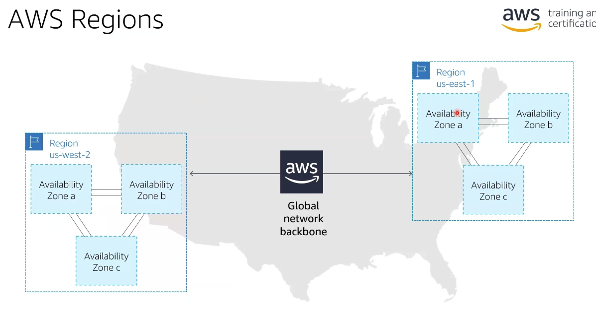
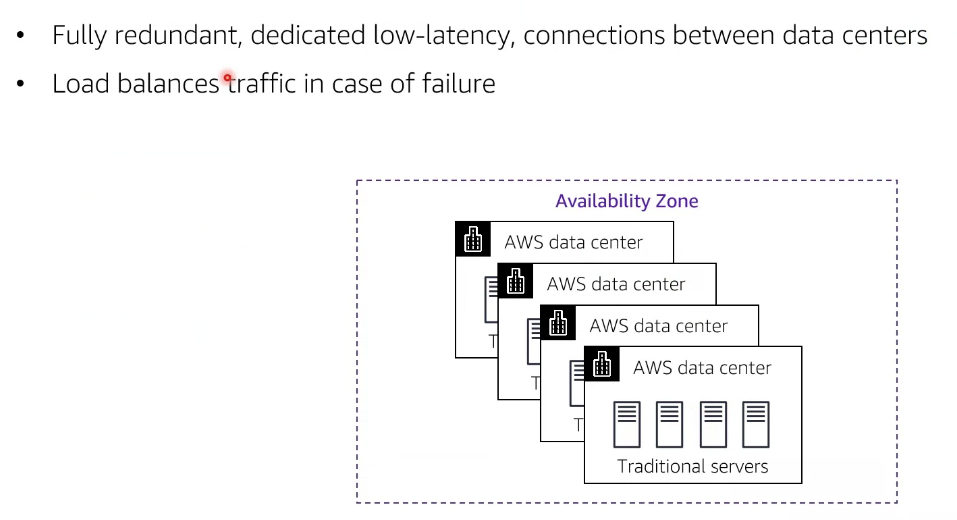
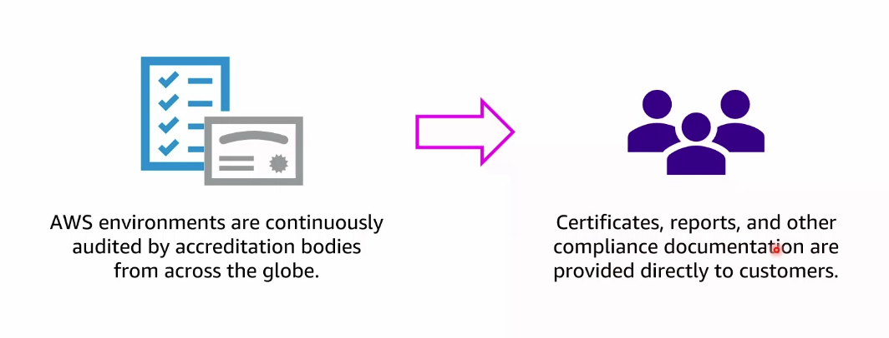
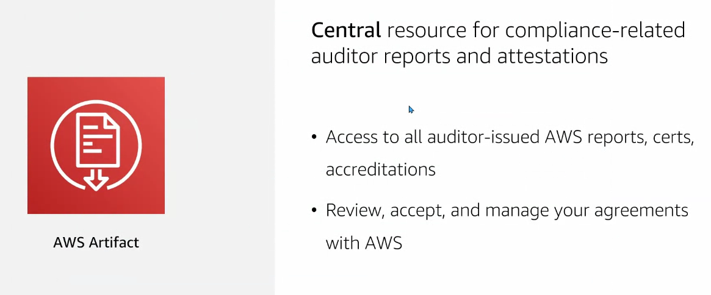
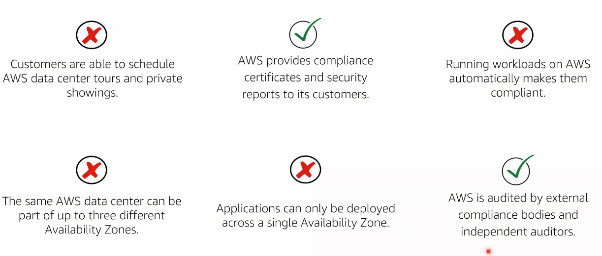

# Module 2: Security of the Cloud

`Regiones`: conjunto de AZ:

La comunicación entre AZ de distintas regiones se realiza mendiente instalaciones físicas (cables de red) propios de AWS. AWS no se apoya en terceros para la comunicación de data entre regiones.

  

## Availability Zones

Una `AZ` posee uno o varios datacenter próximos entre sí. Si cae un datacenter otro recupera la actividad.

  

## Select region

Existen diversos factores que condicionarán nuestra elección de AZ:

- `Compliance`: Existen leyes que limitan el traslado de información entre zonas o países que debemos respetar.
- `Customer latency`: Tiempo de respuesta de los recursos de cara a los usuarios. Buscar siempre la región más cercana a los usuarios.
- `Cost`: Las compañías cambian su gasto físico on-premises por gastos operativos.

## Edge locations

- Los `edge locations` son datacenter para cachear contenido pero este estará disponible de manera temporal.
- `Regional edge caches `(puntos regionales de borde): puntos de cache que distribuyen el contenido a los edge locations

[Ver localizaciones](https://aws.amazon.com/es/about-aws/global-infrastructure/)

## Data center security

Los datacenter físicos de AWS tiene diversos niveles de seguridad:

- `Permieter layer`: La ubicación exacta no es pública. Videovgilancia, accesos controlados, accesos sólo para trabajadores que lo necesitan, etc.
- `Enviroment layer`: Las aplicaciones se desplegarán en múltiples AZ (para tolerancia a fallos). Cargas continuas y simulacros de diversos escenarios.
- `Infraestructura layer`: Detección de fuego y equipos de supresión. Control de climatización. UPS unidades y generadores para tener energía de backup.
- `Data layer`: Implementa las prácticas del NIST (protocolos para la destrucción de información). Auditorías por compañías de terceros y entes de control. Los servidores de AWS envían notificaciones si algún empleado trata de extraer información.

## Compliance on AWS

Compliance and governability público por parte de AWS. Importante: las certificaciones que tenga AWS no son extendibles a la compañía que adquiere productos de AWS. Es decir, las certificaciones de la empresa son independientes de las cert. de AWS.

  

Ver [link](https://aws.amazon.com/es/compliance/programs/)

## AWS service spotlight: AWS artifact

Herramienta de reportes sobre certificaciones.

  

## Questions

  

