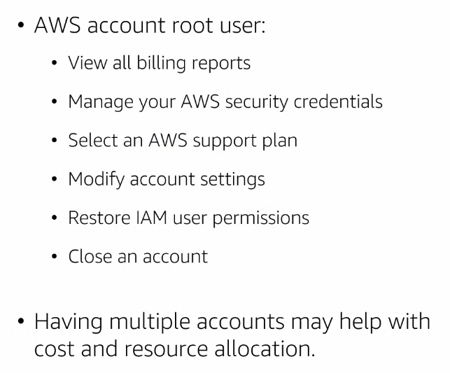

# Module 3: Security in the Cloud part 1

## Identity and access managment

Para acceder a AWS service API endpoint (API interface).

- AWS Managment Console (web)
- AWS CLI: conola de línea de comandos
- SDK: lenguajes de programación
- Another AWS service: como por ejemplo, lambdas.

  

Cuando un cliente realiza un request (meidante las herramientas anteriores) el servicio AWS IAM verifica el acceso con políticas en formato JSON las cuales finalmente conceden o no los accesos.

  

## AWS IAM

Provee un control de los accesos a los recursos (por user, grupos y roles). Permite también dar accesos temporales mediante roles. Federar usuarios

  

## Identidades

Las identidades son entidades que pueden realizar acciones dentro de AWS (usuarios, grupos... pero no un servicio, por ejemplo).

## Users

Un usuario es una entidad que puede generar acciones en AWS

  

## Groups

  

## Roles

Pasos para asumir un rol:

- Administración:

  1. Crear el rol
  1. Asignar políticas a dicho rol
  1. Asignar relación de confianza (identificar el/los usuarios que van a asumir y definir tiempos del rol: de 1h a 12h)
  1. Compartir el nombre del rol
  1. COmpartir el id de la cuenta
  1. EL usuario que crea roles debe tener activa la política de PassRole

- Usuario:
  1. EL usuario no debe ser root
  1. Puede asumir el rol mediante la consola, CLI o SDK
  1. Accionar "Switch Role"
  1. Nombre, id, alias, color
  1. El rol está asumido

  

## User or role?

  

## Access via identity-bases policies

Una política es un doc en formato JSON. Cuando creamos una cuenta en AWS algunas de las políticas ya vendrán pre-definidas por AWS (como S3 full-access).

- Politicas `administradas por AWS`: pueden incrementarse pero no se actualizarán las existentes.
- Politicas `administradas por cliente`: crear políticas desde cero, nombre personalziado, versionamiento.
- Politicas `administradas in line`: son políticas directamente creadas y asignadas en el propio usuario. No existe un repositorio central en AWS de las mismas.

  

Ejemplo de política:

- Versión: motor de AWS que procesará la política
- 2 Statement
  - Posee un id
  - Efecto de permitir
  - Listar los buckets
  - Al bucket específico llamado `myBucket`

  

## Grating access

1. El usuario debe autenticarse en AWS
2. El usuario tendrá asiganda una política con diferentes permisos
3. Cuando trate de ejecutar una acción (borrar un bucket, por ejemplo) se berificará dicha acción contra las políticas anterior. El cambio en las políticas de un user tiene un efecto inmediato.

  

## The AWS account

Los `ASW account root user` posee permisos ilimitados (manejar con cautela):

  

  

## Credenciales de seguridad

  

## Best practices

  

## Servicios adicionales de autenticación y acceso

- AWS Directory service
- AWS Single Sign-On
- Amazon Cognito: repositorio de usuarios de AWS para su gestión (especialmente para móvil)
- AWS organizations: permite a la compañía adminsitrar las distintas cuentas que hay en nuestra organización

  

## Protection via scrypting

## Amazon S3

Amazon S3 es un repositorio de información dónde disponemos de diversos buckets. La data estará encryptada (pudiendo elegir quién la encriptara) y tendremos diversos protocolos para el control de acceso.

  

Existen 3 tipos de protección:

- Object Access Control List
- Bucket ACLs
- Bucket policies

  

  

- IAM identity-based policied: la política más restrictiva tendrá siempre prioridad

## Encryption

La información será cifrada con una llave simétrica + el archivo a encriptar + el algoritmo AES dan como resultado una data encriptada.

  

Esta data encriptada podemos almancenarla en un bucket S3. Para descriptar tendremos las keys (data key y primary) dentro del servicio encrypted data key la cual está almacenada en el encrypted data in storage. Todo este proceso podemos hacerlo mediante el `servicio de KMS` (gestión de llaves).

Si la compañia posee sus propias llaves...

  

Dos opciones de encriptación: lo hace cliente vs lo hace AWS.

  

Ejemplo client side encyption:

  

Ejemplo AWS encyption:

  

## Mejores prácticas en la encriptación

  

> Importante:

`En tránsito`: Se utiliza este tipo de encripción cuando se necesita enviar o recibir información entre dos puntos. Se emplean protocolos SSL, certificados de seguridad, HTTPS, para que la data esté encriptada punto a punto.

`En descanso`: Es una encriptación de data cuando está estática (no se está consumiendo). Usualmente se utilizan algoritmos de encripción como AES256, que provee ofuscación de los datos, dado el caso si se intenta acceder de forma no autorizada.

## Servicios adicionales de protección de servicios

- Managment Service: Servicio que provee de llaves y definimos que usuarios pueden emplearlo
- Secret Manager: Guardar información sensible de manera centralizada (puede configurarse para que exista rotación de claves)
- Amazon Macie: Servicio de seguridad de información con IA que facilita información para una mejor gestión y seguridad
- Certificate Manager: Permite comprar certificados

  

## Questions

  

