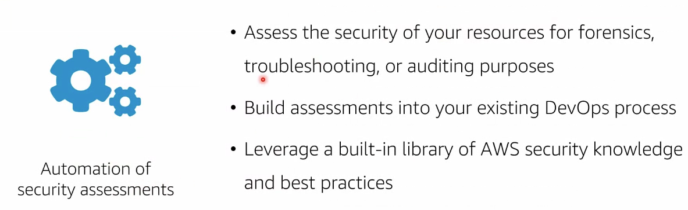

# Module 4: Security in the Cloud part 2

Seguridad en la nube: asegurar nuestra infraestructura, salvaguardar la data, quién podrá acceder, etc. Principalmente hablaremos de la exposición de servicios a través de la red.

## Amazon VPC

`Amazon VPC`: Virtual private cloud. Servicio mediante el cual creamos un espacio aislado en la nube donde montar nuestros recursos. Podemos crear múltiples componentes (lambdas, EC2, servidores...). Dentro de una VPC podemos tener:

- `Redes públicas`: pueden salir hacia internet
- `Redes privadas`: aisladas, sin acceso a internet

  

## VPC components

Dentro de una VPC pueden existir múltiples subredes en múltiples AZ. Es decir, una VPC puede cruzar zonas de disponbilidad. En el siguiente ejemplo vemos que tenemos una VPC que cruza los usos horarios de diversas AZ. Además posee subnet privadas y públicas, baleanceadores de carga, instancias EC2, NAT gateways (herramientas para actualizar las private subnet), internet gateway...

  

## Internet Gateway

Uno para la VPC:

  

## Load Balancing

  

## Beneficios de instalar un ELB

- Certificado
- Único punto de acceso
- Diferentes integraciones con servicios

  

## VPC Security Features

Dentro de la VPC existen diversas capas de seguridad:

- `Security group`: firewall a nivel de instancias
- `Network ACLs`: access control list o firewall de red
- `Subnet routing`: routing tables

  

## Subnets and routes tables

Diferencia entre subredes privadas y subredes públicas: enrutamiento que existe hacia internet.

Una `route table` contiene todo un set de reglas (llamadas rutas) que determina hacia que direcciones IPs puede dirigirse el tráfico de paquetes de nuestra subnet.

- IGW (internet getaway)
- La subnet A tiene un total de 65.536 direcciones disponibles
- Si el ping está comprendido en la `tabla de rutas` comprueba, según sus reglas, si está dentro del rango local o público.

  

¿Que ocurre cuando las instancias que tenemos en la subred privada necesita internet para actualizarse? Emplearemos un `NAT gateway (servidor de salto)`:

  

El NAT gateway solo funciona si la petición la ejecuta la instancia (no desde internet).

## Network ACLs

Podemos establecer las ips de entrada y salida.

  

## Security groups

Solo existen si hay instancias.

  

## Flujo de petición desde internet

  

## Best practices

  

## EC2 and AMIs

Una imagen de máquina de Amazon (AMI) es una imagen compatible y mantenida que ofrece AWS y que brinda la información necesaria para lanzar una instancia. Cuando necesite varias instancias con la misma configuración, puede lanzarlas desde una misma AMI.

Una AMI contiene información acerca de la(s) instancias que quiero ejecutar. Aplicaciones, SO, configuraciones, permisos de lanzamiento (quién puede lanzar esa máquina), plantilla de volúmenes (los discos duros conectados a la máquina) (root etc).

`AMIs`: al igual que un ISO, contiene todos los volúmenes anclados a una máquina. Tiene permisos de lanzamiento. Todo el listado de discos duros conectados a una máquina. A partir de una AMI puedo crear instancias EC2.

  

- Podemos crear nuestros propios AMIs, emplear las de la comunidad, las facilitadas por AWS...
- Emplear siempre AMIs certificadas
- El ID de las AMIs varía en función de la región
- En caso e vulnerabilidad, podemos cerrar instancia y volver a generarla desde la AMIs

  

Sin embargo, para evitar vulnerabilidades podemos emplear la herramienta de ` amazon inspector:` servicio para verificación de seguridad, reportes, etc... Unicamente funciona con instancias EC2.

  

Debemos encargarnos siempre de la seguridad:

  

Ejemplo de automatización del proceso:

  

## Best practices

  

## Additional infraestructure protection services

- AWS Systems manager: administrar todas nuestras máquinas (aplicar parches, por ejemplo)
- AWS Direct Connect: Conexión directa desde el datacenter on-premises a AWS sin salir a internet
- CloudFormation: tratar la infraestructura como código (de manera automática)

  

## AWS CloudTrail

  

Nos permitirá responder las sigueintes preguntas:

  

Servicios con built-in logs:

- `S3 server access logs`:
- `Flow logs`: trazabilidad desde donde se hizo el request cual fue la respuesta
- `Elastic Load Balancing access logs`:

  

## CloudWatch

Monitor y report los recursos que tenemos en AWS (como funcionan las bbdd, los lambda, los baleanceadores, etc etc).

  

Funcionamiento:

  

## Best practices

  

## Additional

- AWS trusted Advisor: Escaneará toda la insfraestructura y nos notificará sobre malas prácticas junto con consejos sobre mejores prácticas (por ejemplo, tienes todos los puentos abiertos)
- Amazon EventVridge: Configurar alarmas cuando ocurra un evento (apagar las instancias de QA los fines de semana)
- AWS Security Hub: Administrador de servicios dónde se hacen comprobaciones de seguridad. Orquestador que brinda pautas sobre mejores prácticas en términos de administración, firewals, datos, métricas, peticiones...
- Amazon GuardDuty:

  

## Questions

  

