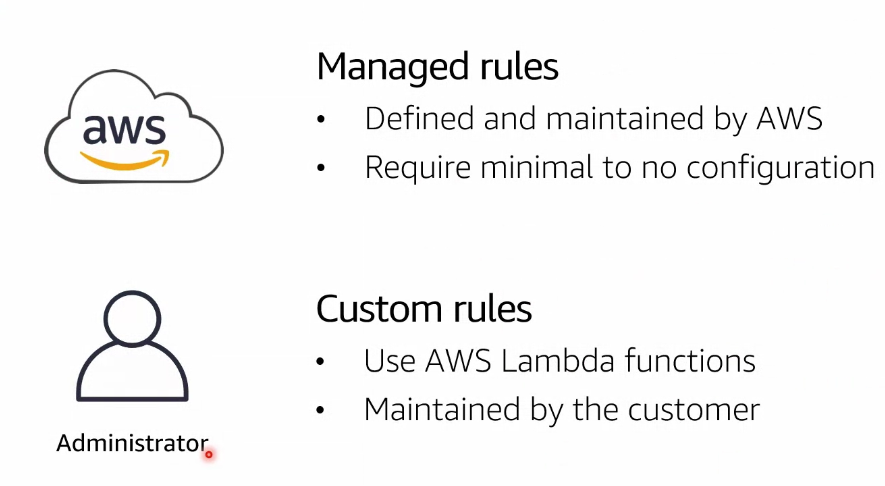

# Module 5: Security in the Cloud part 3

`Ataque de negación de servicio (DDoS)`: llegan múltiples peticiones sin ningún fin. Estamos hablando de una innundación de tráfico que hace que el servidor, ante no poder responder a tal volumen de consultas, cae. Digamos que es un intento explícito de evitar un uso legítimo de un servicio o recurso.

  

## AWS WAF

`Web Aplication Firewall`: como cualquier otro firewall, posee reglas de entrada y reglas de salida. Con este podemos gestionar rangos de IP válidos que puedan acceder a nuestros servicios (antes de que llegue a nuestros baleanceadores e instancias).

  

¿Cómo funciona? Cuando creamos un WAF se genera un ACL donde se añadirán las reglas. Las reglas filtran el tráfico deseado o no deseado. Podremos monitorear el tráfico (quién solicita, qué solicita, destino, etc). Existen reglas administradas por AWS (grauitas y de pago).

  

  

- Ver el origen IP de las peticiones
- Bloqueo por países
- Admite expresiones regulares para gestionar el acceso (o no) a aplicaciones.
- Filtro por cantidad o tamaño de request
- Detección código SQL malicioso

  

## Additional DDoS mitigation services

¿Como sabe WAF si es un DDoS? Mitiga ciertos ataques por las IP restringidas pero es mejor complementar con:

- Route 53
- AWS Shield: standar (gratis) y advance (subcripción mensual: soporte 24/7)
- Amaon CloudFront: los edge copian el contenido cacheable en una región distante para facilitar un consumo sin latencia a los usuarios
- AWS Firewall Manager: muestra información sobre reglas establecidas por cliente y recomienda acciones por cada uno de los mismos

  

  

## What is an incident?

  

## Foundation of incident response

Respuesta frente a un incidente:

  

## Incident response on AWS

Cuando sufrimos un incidente dentro de la consola de AWS existen respuestas:

- Automatizadas: bloqueo de puertos, por ejemplo, si el consumo es de una zona anómala.
- Es posible eliminar instancias atacadas pero no se borran sino que se pueden volver a ejecutar en un entorno forense
- Operar en un entorno diferenciado (ambiente controlado o limpio) de producción
- Login detallado

  

## AWS Config

`AWS Config` es un servicio que permite examinar, auditar y evaluar las configuraciones de sus recursos de AWS. Config monitorea y registra constantemente las configuraciones de sus recursos de AWS y le permite automatizar la evaluación de las configuraciones registradas con respecto a las configuraciones deseadas.

AWS Config captura continuamente ciertos cambios de las configuraciones de nuestros recursos, permitiendo dar respuesta a los incidentes de manera automática o manual.

  

## AWS Config rules

  

## AWS config conformance packs

Packs de conformidad.

  

## Evaluation rules

Las reglas se evaluarán de manera automatizada junto con el envío de notificaciones.

  

Asíque emplearemos AWS para saber que ocurre con nuestras aplicaciones a nivel de configuración:

  

## AWS service spotlight: AWS Lambda

Permite ejecutar un fragmento de código que realiza una acción concreta (apagar un puerto, por ejemplo). Lambda puede estar ligado a cualquier servicio de AWS.

  

## Allowing actions

Las lambdas pueden asumir un rol de ejecución: permite que una función llegue a su destino.

  

## Addtional incident response services

- `AWS Step Functions`: Maquina de estados con un inicio y final dónde en su trascurso de vida puede llamar a una lambda, luego a otra, luego un sms, luego otra lambda, etc.
- `AWS CloudFormation`: servicio de infraestructura de código. AWS CloudFormation es un servicio que lo ayuda a modelar y configurar sus recursos de AWS, por lo que podrá dedicar menos tiempo a la administración de dichos recursos y más tiempo a centrarse en las aplicaciones que se ejecutan en AWS. Puede crear una plantilla que describa todos los recursos de AWS que desea (como instancias Amazon EC2 o instancias de base de datos de Amazon RDS) y CloudFormation se encargará del aprovisionamiento y la configuración de dichos recursos.
- `Amazon SNS`: notificaciones

  

## Best practices for incident response

  

## Questions

  

