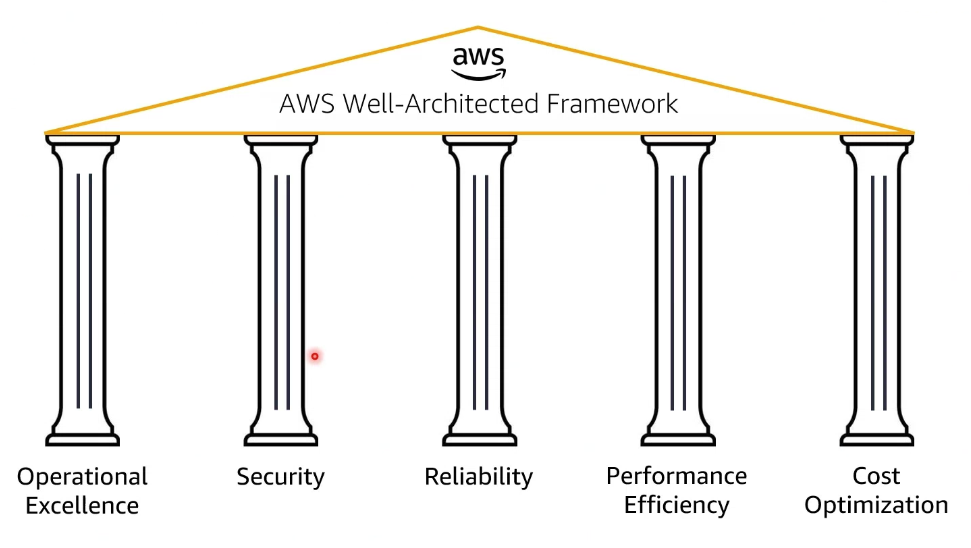
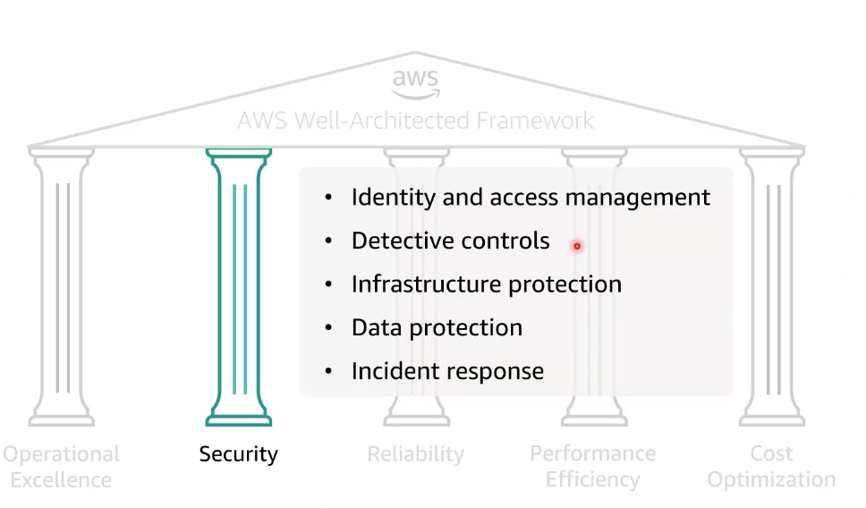
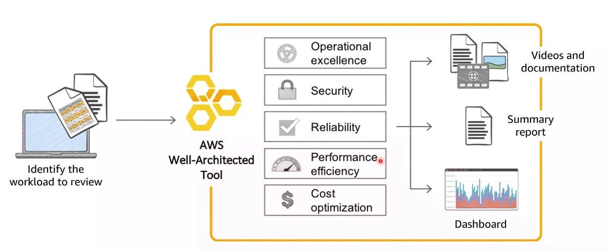
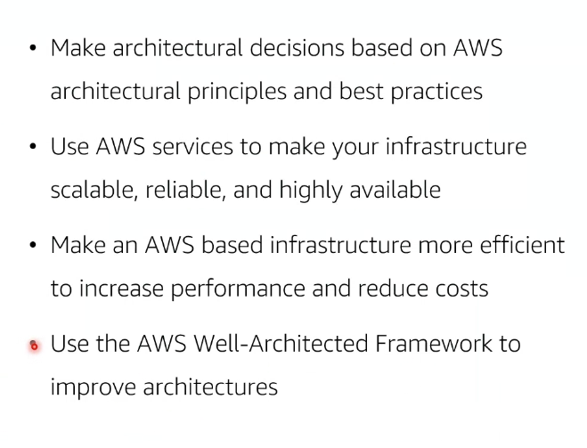
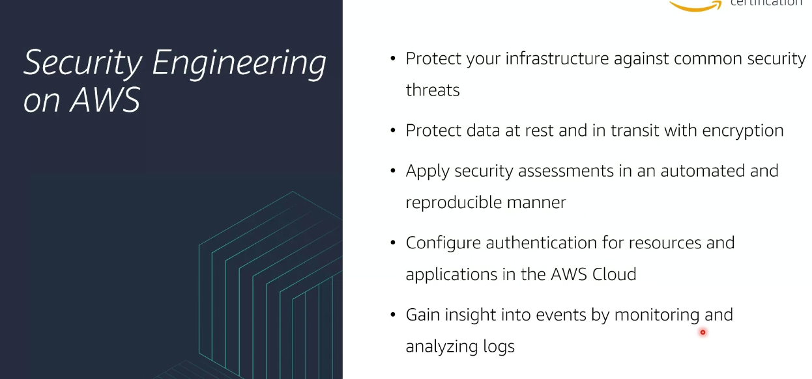

# Module 6: Course Wrap-Up

Recordemos que `TrustedADvisor` escanea nuestra infraestructura y ons facilita recomendaciones. Este servicio descasa sobre el `AWS Well-Architected Framework`.

  

Nosotros nos centramos principalmente en la parte de seguridad:

  

TrustedADvisor es un servicio que podemos utilizar siempre que paguemos el plan de soporte de AWS (es decir, hay una capa gratuita para todos los clientes pero con la suscripción tenemos acceso a todas las features).

`Well-Architected Tool`: preguntas que nos guían para conocer la configuración de nuestra estructura. Son preguntas relacionadas con diversos campos (seguridad, fiabilidad, etc). No es lo esperado sino lo que realmente hay en nuestra compañía. Con todo ello recibiremos un reporte con las mejoras a realizar en nuestra compañía.

  

## Suggested next course: Architecting on AWS

  

## Suggested next course: Security Engineering on AWS

  

