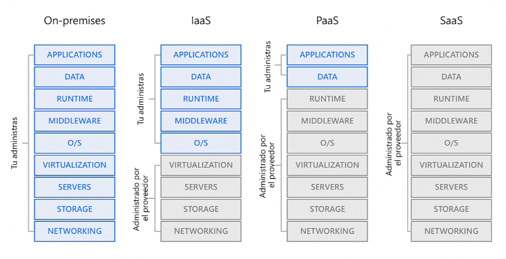

# Definiendo el cloud computing

Entrega de servicios informátcos incluídos servidores, almacenamiento, bbdd, redes, software de análisis e inteligencia a través de internet para ofrecer una innovación más rápida, recursos flexibles y economías de escala.

Normalmente con el cloud solamente se paga por los servicios empleados, lo que ayuda a reducir costos operativos, administrar la infraestructura de forma más eficiente y escalar a medida que cambian las reglas de nuestro negocio.

Desde edl punto de vista de la `definición de Azure` tenemos:

  

Algunos de los principales proveedores de cloud son: Microsfot, Amazon y Google.

## Responsabilidades de los proveedores

Entre sus responsabilidades destaca la disponbilidad del hardware físico necesario para ejecutar las soluciones de sus clientes y el mantenimiento y actualización del mismo.

- Capacidad de cómputo: capacidad de ejecución de aplicaciones sobre máquinas virtuales bajo demanda
- Almacenamiento: bbdd o archivos
- Dispnibilidad de componentes de conectividad de red
- Servicios de análisis y monitoreo de recursos

## El cómputo en la nube

- Máquinas virtuales
- Contenedores
- Serverless

Las `máquinas virtuales` es una emulación de un equipo (ofrecen gran control sobre el mismo) incluyendo SO y hardware sobre el que instalar cualquier software para ejecutar nuestras tareas. No es necesario comprar hardware o instalar el SO: el proveedor ejecuta la máquina virtual en un servidor físico, en uno de sus centros de datos, compartiendo el servidor en máquinas virtuales de manera aislada y segura. `A menudo podremos tener una máquina virtual lista en minutos con un costo menor que un equipo físico`.

  

`Contenedores`: proporcionan un entorno de ejecución coherente y aislado para las aplicaciones. No requieren un SO (como las máquinas virtuales) sino que la app y sus dependencias se empaquetan y se emplea un entorno de ejecución. Esto nos permite que el contenedor se inicie en pocos segundos ya que no hay un SO que inicializar: solo se necesita la app para iniciar.

Un ejemplo del mismo es `DOCKER`. Es posible ejecutar distintos contenedores en una misma máquina: alta portabilidad que faclita la implementación de aplicaciones en iversos entornos.

  

`Serverless`: en este modelo solo pagamos por el tiempo de procesamiento (en los modelos anteriores se paga aunque no se empleen las aplicaciones o estén inactivas).

Esta arquitectura es respecialmente recomendable cuando la lógica de nuestra aplicación se puede separar en unidades independientes y podemos ejecutarlas por separado, actualizarlas e iniciarlas en milisegundos, lo que lo convierte en `la opción más rápida` para la implementación.

  

## Enfoques de cómputo

  

## Almacenamiento de datos

Los proveedores cloud también suelen ofrecer servicios de almacenamiento de múltiples tipos de datos. La ventaja es que posee `alta escalabilidad` (incluso automáticamente).

  

## Modelos de implementación

Definirá dónde se almacenan los datos y como interactuan los clientes con los mismos. Existen tres métodos de implementación, que dependerán de nuestro presupuesto, necesidades de escalabilidad y matenimiento.

## Nube pública

- ✅ Sin hardware local dónde todo se ejecuta en el proveedor de la nube (Azure)
- ✅ Gran agilidad y escalabildiad sin inversión en servidores propios.
- ✅ Modelo pago por uso dónde el proveedor se encargará del mantenimiento del hardware.
- ✅ Se aprovecha del conocimiento técnico del proveedor para que las cargas de trabajo sean seguras y manejables.
- ❌ Requisitos de seguridad que no te permitan usar nube pública
- ❌ No se es dueño del hardware y los servicios

## Nube privada

- ✅ Centro de datos propio
- ✅ Control sobre la seguridad
- ✅ Cumplimiento estricto sobre los requisitos legales
- ✅ Total control sobre la configuración del software
- ❌ Responsabilidad sobre compra (CAPEX) y mantenimiento del hardware y software
- ❌ Alto conocimiento y preparación técnica

## Nube híbrida

- ✅ Ejecutar aplicaciones en la ubicación más deacuada (web en pública, bbdd en privada).
- ✅ Es posible mantener aplicaciones aunque el software o hardware esté desactualizado.
- ✅ Aprovechar los recursos de la nube (más barato)
- ❌ Costos CAPEX
- ❌ Costos en gestión y administración

  

## Tipos de servicios en la nube

  

`IaaS`: altamente flexible ya que proporciona control total sobre el hardware que ejecuta la aplicación. Incluye máquinas virtuales, almacenamiento y SO. infraestructura flexible y gestionada mediante internet. El proveedor debe garantizar la infraestructura pero el usuario se responsabiliza de la configuración, actualización y disponbilidad de la aplicación.

Posee un `modelo de responsabilidad compartida` dónde dada su sencillez es idela para la migración de aplicaciones existentes, evitando gasto de capital y simplificando la administración del almacenamiento de información que normalmente requiere personal cualificado.

También es útil para administrar una demanda variable o la creciente necesidad de almacenamiento. Simplifica la planificación y sistemas de backups.

`PaaS`: Proporciona un entorno dónde crear, probar e implementar aplicaciones. No existe la necesidad de crear una infraestructura subyacente (sin instalación de SO o servidor web). Entorno completo de desarrollo e implementación en la nube dónde no hay que administrar máquinas sino que nos enfocamos en la aplicaicón.

`SaaS`: Licencia de suscripción sin necesidad de adminsitración de componentes, aplicación o infraestrucutra. Por ejemplo: Offcie356 o Skype.

  

## Responsabilidades de administración

  

