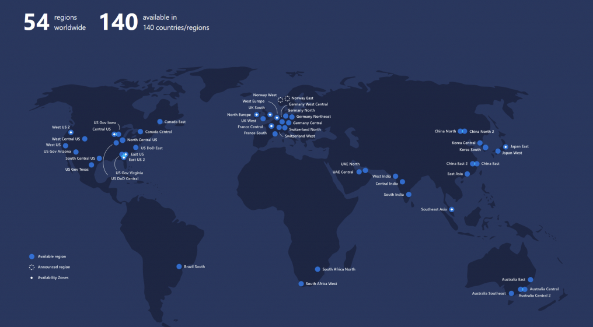
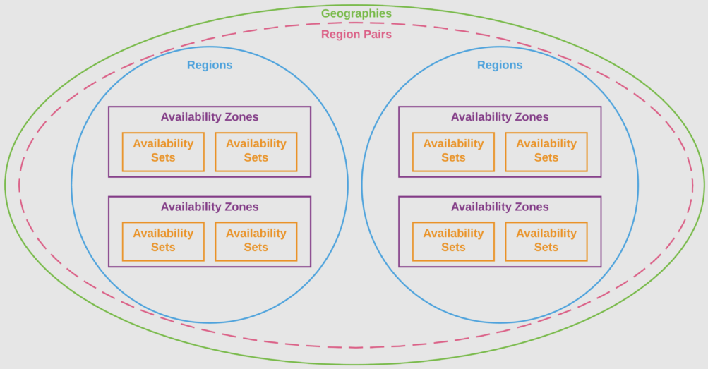

# Principales componentes de la arquitectura AZURE

- Regiones y centros de datos en Azure
- Zonas geográficas en Azure
- Zonas de disponibilidad en Azure
- Regiones Pares en Azure
- Niveles de Acuerdo de Servicio en Azure (SLAs)

## Regiones y centros de datos Azure

Microsfot Azure se compone de centros de datos ubicados por todo el mundo: cuando cremoas un recurso (una máquina virtual) se usa un equipo físico en una o varias ubicaciones. Los centros de datos no se exponen al usuario final sino que Azure los orgniza en regiones.

`Una región`: área geografica del planeta que continene al menos un centro de datos, pero potencialmente varios, próximos y conectados entre si junto a una red de baja latencia. La región sirve para identificar la ubicación de recursos y dan flexibilidad de acceso a los usuarios para sus apps sin importar dónde se encuentren. Las regiones ofrecen:

- Escalabilidad
- Redundancia
- Residencia de datos

Al crear recurso elegimos la región dónde este se aprivionará, aunque existen ciertas particularidades:

- Algunos recursos o características solo están disponibles en ciertas regiones (como máquinas de cierto tamaño o bbdd)
- Algunos servicios no requieren seleccionar región (Azure Active Directory, Azure Traffic Manager o Azure DNS)
- Alta escalabilidad, redundancia y conservación de datos para servicios en determinadas zonas
- Azure tinee regiones especializadas para cumplimiento con determinadas leyes
- Asociaciones entre microsfot y proveedores locales (China, por ejemplo)

  

## Zonas geográficas

La residencia de datos se refiere a la ubicación física o geográfica de los datos. Influye sobre la misma los requisitos legales o impuestos basados en el país o región en la que residen. POr ello Azure establece una división en `zonas geográficas` que son definidas por fronteras geopolíticas o geográficas.

Una zona geográfica contiene dos o más regiones que comparten límites de cumplimiento y residencia de datos. Sus beneficios son:

- Los requisitos de residencia, sobrería y resiliencia de datos se cumplan dentro de un límite geográfico
- Tolerancia a fallos por su conexión a una infraestructura de red dedicada
- Estas se dividen en: Amércias, Europa, Asia Pacífico y África

  

Cada región pertenece a una única zona geográfica y tiene reglas específicas de disponibilidad, cumplimiento y resiliencias aplicadas.

## Zonas de disponibilidad

Las zonas de disponibilidad son centros de datos físicamente independientes dentro de una región de azure. cada zona de disponibilidad se compone de uno o más centro de datos equipados con alimentación, refrigeración y redes independientes. Si una zona cae, las demás siguen funciionando. Las zonas de disponiblidad están conectadas a través de redes privadas de fibra óptica de alta velocidad. A tener en cuenta:

- No todas las regiones tienen compatibilidad con las zonas de disponibilidad
- No todos los servicios son compatibles con zonas de disponibilidad

Podmeos emplear zonas de disponibilidad para ejecutar aplicaciones de misisón crítica y crear alta disponibilidad en la arquitectura de la app (con posible costo asociado). Principalmente se emplean para:

- Máquinas virtuales
- Discos administrados
- Balanceadores de carga
- BBDD SQL

Los servicios de Azure que adminten zonas de disponbilidad se dividen en 2 categorías

- `Servicios zonales`: Lugar dónde asignamos el recurso a una zona específica (máquinas virtuales, discos administrados, direcciones IP, etc)
- `Servicios con redundancia de zona`: Servicio que se replica automáticamente en todas las zonas (una bbdd SQL, por ejemplo).

## Regiones Pares

> `Centros de datos`: recursos físicos --> `Zonas de disponibilidad`: uno o varios centros de datos --> `Región`: agrupación de mínimo 3 zonas de disponibilidad --> `Zona geográfica`: agrupación de regiones

`Cada región tiene su par` dentro de la misma zona geográfica: replicaición de recursos que ayuda a impedir la interrupción de servicios en distintas regiones. Ventajas:

- Agilidad en recuperación de desastres
- Minimizar el tiempo de inactividad en actualizaciones planificadas de Azure
- Los datos siguen residiendo dentro de la misma geografía
- Garantía de alta disponibilidad
