# Azure cloud computing

- Introduction to cloud computing
  - Services are billed on demand (minute or hour)
  - Organizations can create new resources when needed and shut them off also
  - Dyamic and cost-effective
  - Reduces up-front cost

## History

Dedicated hardware --> Virtualization --> `Cloud Computing`

_Cloud computing enables companies to consume a compute resorce, such as a virtual machine, storage, or an application, as a utility -- just like electricity -- rather than having to build and mantain computing infraestrcutures in-house._

## Types of Cloud Computing Services

> `Difference`: How much you manages vs how much the cloud vendor manages.

- `On-premises`: You are the one that manages everything
- `Infraestructure as a Service (IaaS)`: Cloud computing infrastructure depends on organizations: Azure compute (Virtual Machine), Azure Storage...
  - Test and development
  - Storage and backups
  - High performance computing
  - Big data analysis
- `Platform as a Service (PaaS)`: Provides framework for developers that they can use to create customized applications: Azure Logic Apps, Azure Functions, Azure Web Jobs, Azure Automation...
  - Analytics or business intelligence
  - Development framework
- `Software as a Service (SaaS)`: Use the service on web browser, no instalation and pay a fee (dont't manage): SharePoint, OneDrive for Business, Microsfot Teams, Power Platform...
  - Gain access to sophisticated applications
  - No manage infraestructure
  - Mobilize your workforce easily

  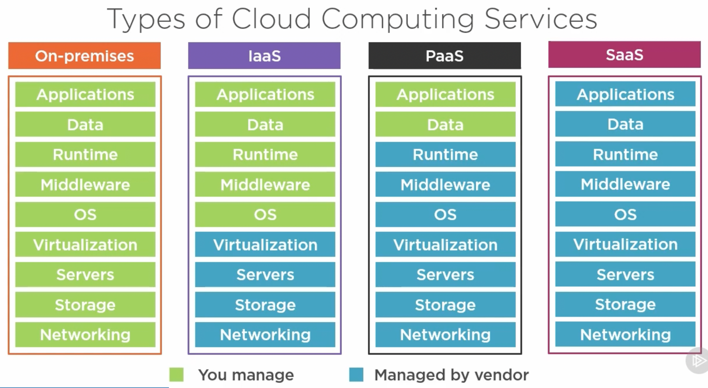

- Cloud computing deployment models
  - `Public cloud`: cloud vendor provides cloud services to multiply clients (securely share same hardware)
  - `Private cloud`: hardware use by one single company
  - `Hibrid cloud`: combination of both public and private cloud with automation and orchestration between the two
  - `Comunity clouds`: shared infraestructure between several orgs with common security, compliance, and jurisdiction concerns

  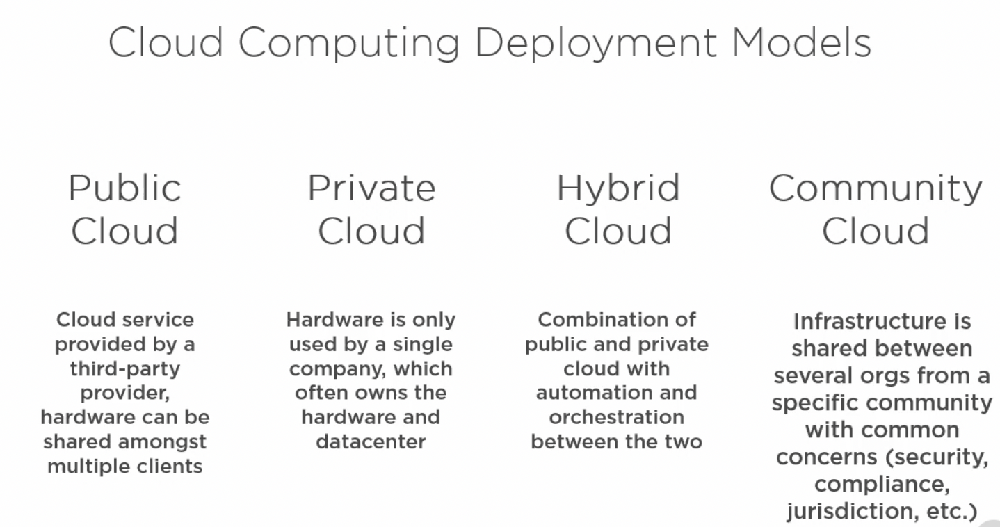

## Concepts

- `CapEXs`: Capital expenditures are funds that a company use to purchase major physical goods or services
- `OpEXs`: Operating expenses
- `Economy of scale`: makes it more cost effective than any individual company
- `IT Pre-Assembled Components (ITPACs)`: pods of servers with their own electricity, ventilation and cooling (as containers)

## Reliability

Cloud proviver takes care of high availability (HA) and disaster recovery (DR). `Cost can grow` quickly (2nd datacenter rent, networking, utilities...).

- `HA`: local failure as a disk, rack goes down, power supply, etc
- `DR`: Natural or human-induced disaster
- `Fault Tolerance`: similar to HA but offers zero downtime
- `Redundancy`: data is stored three times within a single data center (you can choose expand across datacenters)

## Physical Deployment

Will affect to `performance and availability` of your applications and data.

- `Availability Zones`:
  - Unique physical locations within a single region
  - One or more data centers equipped independent power, cooling and networking
  - When available, there is a minimun of 3 separate zones
- `Azure Regions`: Physical location of a data center o multiple data centers
- `Azure Geographies`: Used to meet data residency and compliance requirements (a country o set of countries)
- `Regions Pars`
  - Data centers usually 300+ miles apart
  - Autiomatic replication
  - Failover for some Azure services
  - High availability (service updates, outage recovery prioritization)
- `Edge locations`: smaller data centers that brings data even closer to user

  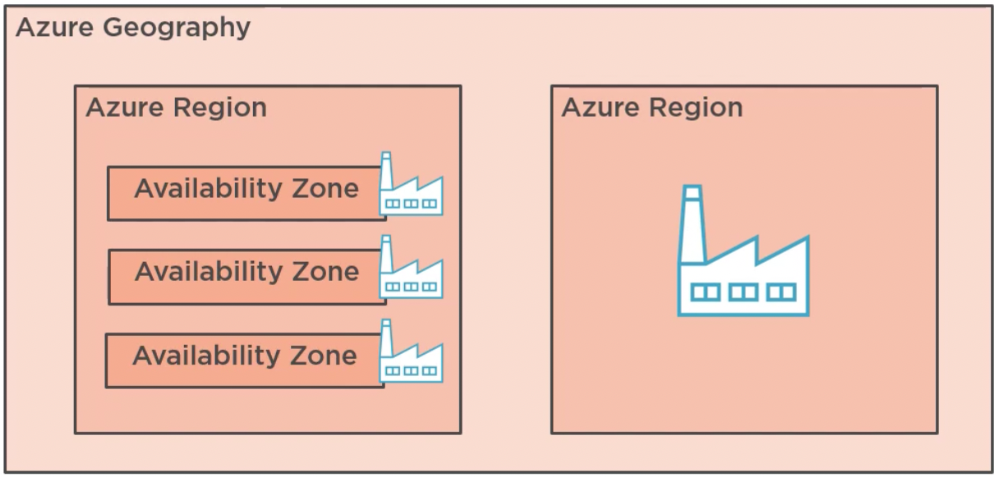

## Regions and Availability Zone

Physical server are located on `datacenters`. Those are physical building located all around the world (over 200 MSFT Azure datacenter worldwide):

  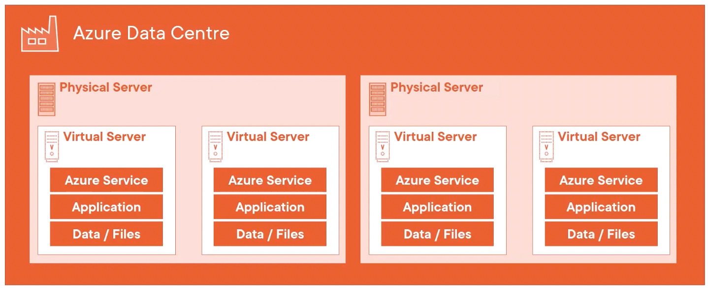

Datacenters are located in `regions`:

  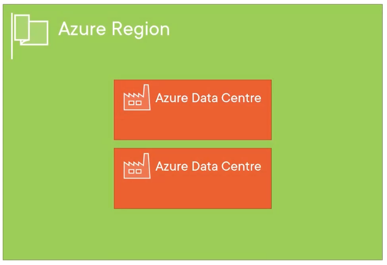

But within certains regions, there's `availability zones`: unique physical locations within a single region (minimun 3 AZ per region).

  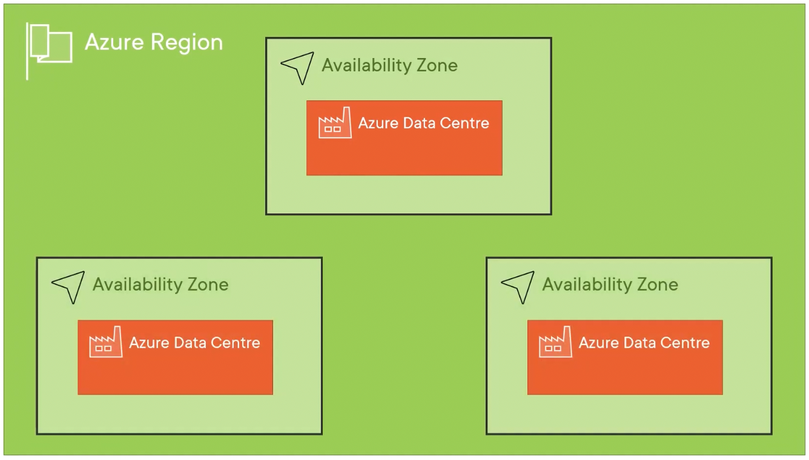

`Azure geography` is a group of regions that define a boundary for data residency and disaster recovery. AG usually is a single country, but it can be made up of multiple countries. Within a AG, there are `regions pairs available`:

  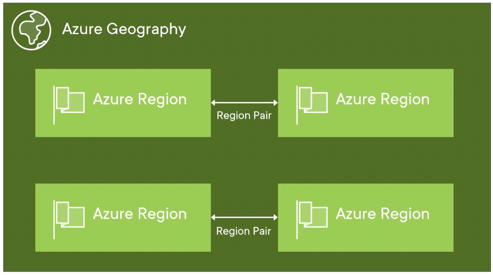

## Suscriptions and Azure Active Directory Tenant

  

## Resource

`A resource` is a manageable item in Azure (VM, Storage Accounts, Web Apps, DBs, Virtual Networks...).

`A resource groups` is a container (metadata about the resources) that holds related resorces that share:

- Same lifecycle (deploy, update and delete them together)
- Resources can only exist in one Resource Groups
- Resources can communicate across Resource Groups
- You can apply security controls to it for administrative actions (security boundaries by rol)
- Can export infraestructure-as-code using Resource Manager Templates (JSON): export template in order to deploy those resources in a repeatable way (move solution from dev to pro)

## Azure Resource Manager (ARM)

ARM is the deployment and managment service for Azure, and it's central to all the creation, deletion and modification of resources that you do in Azure. For example, Azure Portal (website) send a request to the ARM endpoint that handles authentication using `Azure Active Directory (Azure AD)` and authorizes the action. ARM is used for all the tools that you use to manage Azure resources.

  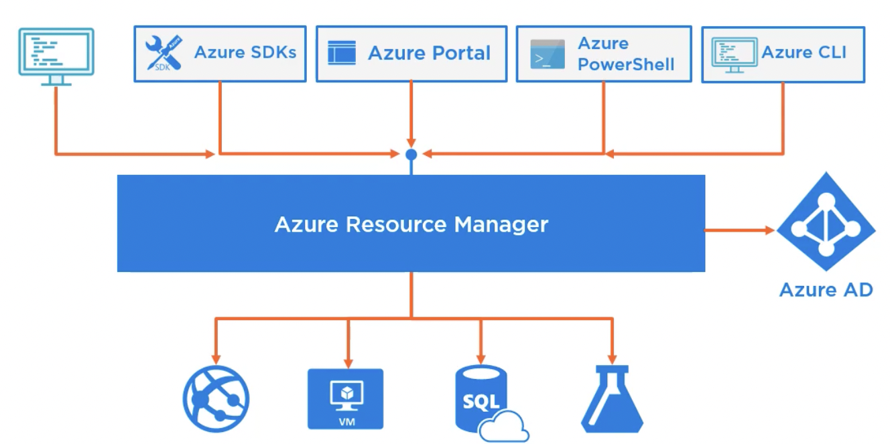

## Agile Development and DevOps

- Combines IT Operations and Development
- Infraestructure now begin managed as code
- Can be stored and versioned in code repositories
- Included in CI/CD pipelines

`Azure Resource Manager Templates` are used to implement infraestructure as code we have files written in JSON:

- Defines infraestructure and configuration for Azure resources
- Declarative syntax
- Deployment
  - Using Azure Pipelines (CI/CD)
  - From GitHub
  - PowerShell and Azure CLI
  - Resource Manager REST API
  - Using the Azure Portal

## Azure Advisor for Optimizing Resources

`Azure Advisor` as a personalized cloud consultan thatn helps follow best practices to optimize deployments. Recomendations:

- Improve performance, availability and security of resorces.
- Ways to save cost in Azure.

## Azure Compute

`Azure Compute` is a set of services that provides on-demand computing power related to running application workloads.

- `Virtual Machine`: IaaS
- `Containers`: Virtualized enviroments for running applications (no OS, more lightweight)
- `Azure App Service`: PaaS for host applications (also API and APPs)
- `Serverless Compute`: Build applications without managing any underlying infraestructure
  - `Azure Functions`: allows run small bloks of code
  - `Azure Login Apps`: allow configure workflows in the cloud
  - `Azure Event Grid`: build applications that respond to events

  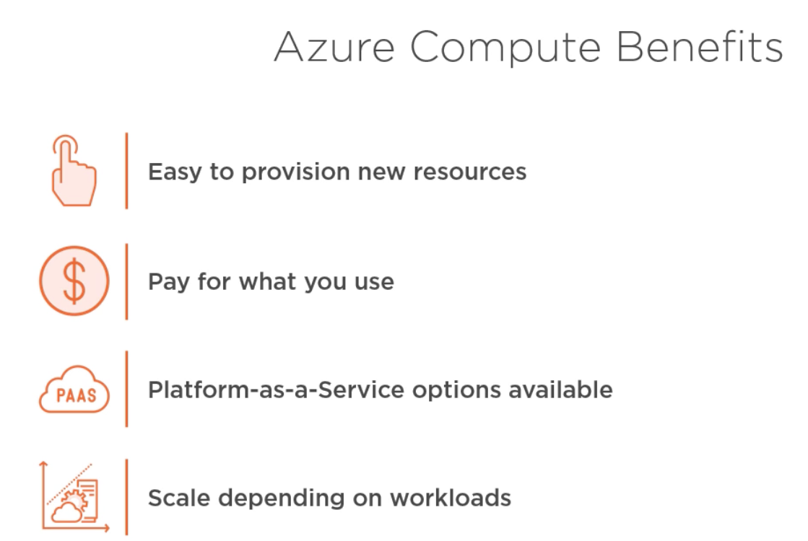

## Azure Virtual Machines

IaaS that allows full control over operationg system. We must maintain and patch VM. `Virtualize the hardware`. Decisions:

- Type of image (OS and softwares)
- Size (RAM, processors, etc)
- Availability options

> Azure Market Place: online store that offers applications and services created by MSFT or technology partners.

## Virtual machine Scale Sets

Group of VMs with load balancing when number of VMs can scale out/in (in response to load o schedule). Also can be spread across fault domains and update domains. Only pay for the underlying resources.

## Containers

`Containers` a way to wrap up application into its own isolated package for server-based applications and services (web apps, as example). `Virtualize the software`

  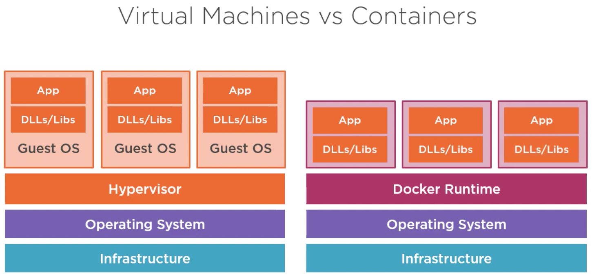

- A `container` is an `instance of a container image`
- An `image` is a read-only template with instructions on how to create the container
- `Container registry` is a service that stores and distributes container images (Docker Hub or Azure Container Registry)

  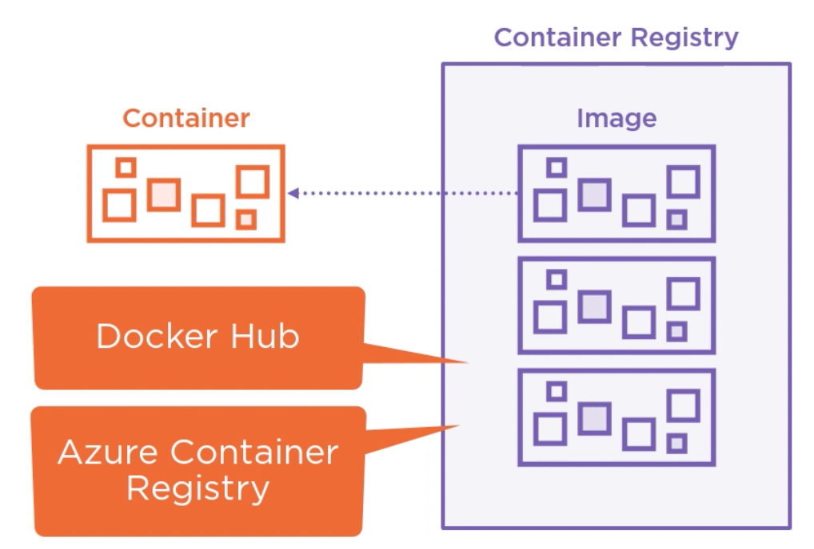

## Docker

- Standar for container format
- Runtime for Docker containers
- Open-source project that automates the deployment of a containers that can run in the cloud or on-premises
- Is a runtime process that we can install on any workstation or VM

  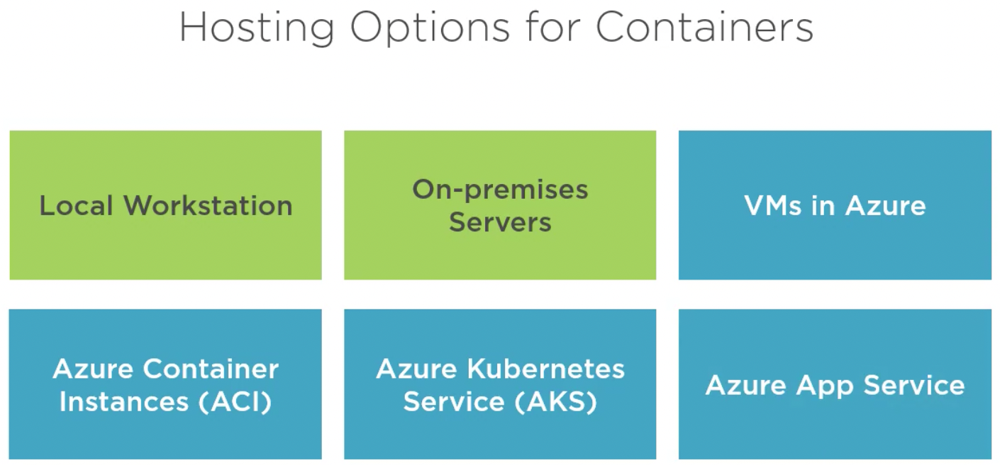

## Azure Kubernetes Service (AKS)

- Container managment system in Azure
- Scale out container-based applications (adding, removing and monitoring the deployed containers)
- `Pods`: groups of containers
- `Nodes`: Kubernetes runs POnd on nodes, which in AKS are VM
- Choose VM scale sets for automating scale out
- Conect AKS cluster with Azure Container Registry to pull container images and build containers from those images
- Azure Monitor

Azure main services for hosting containers:

- Azure Container Instances
- Azure Kubernetes Service

## Azure APP Services

- Similar to traditional web hosting
- Framework runtimes installed on servers
- Azure manages web servers for you

Can host:

- Web APPs
- API APPs (REST protocol web service)
- Host backend code from Mobile APPs
- Can deploy containers
- WebJobs that allows run services on the underlyng VMs of the App Service

`App Service plan`: defines the size of the underlying infrastructure (choose CPU, RAM and storage, aka `pricing tier`)

  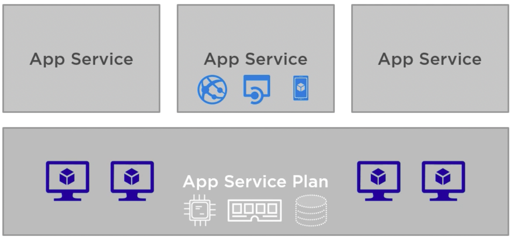

## Serverles Compute in Azure
