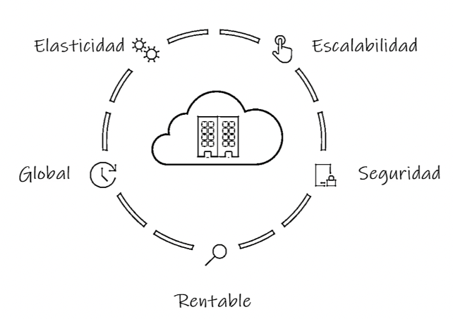
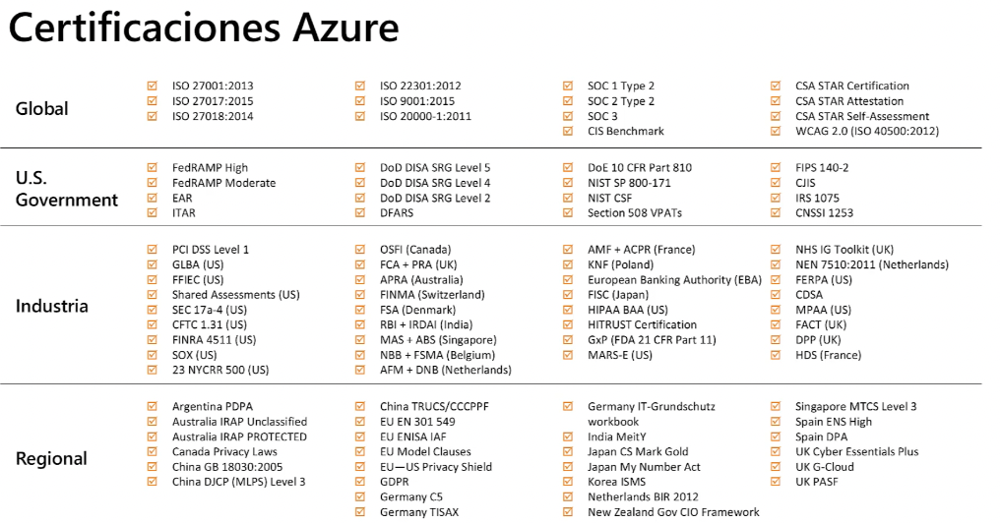
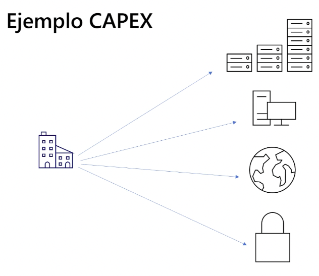
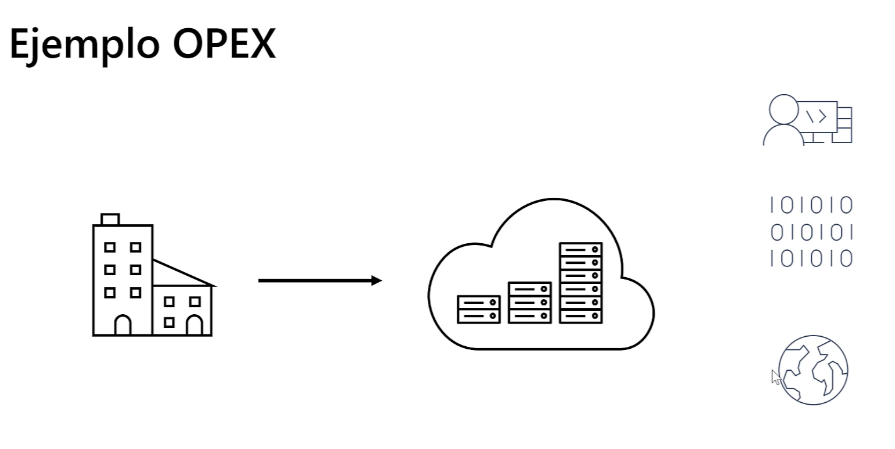
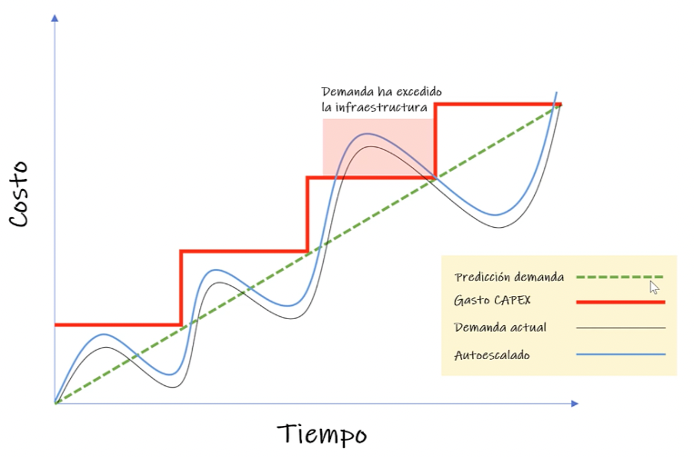

# Introducción al cloud computing

- Definición
- Beneficios
- Términos y requisitos: compliance
- Economía en la nube: CapEx & OpEx
- Modelos de nube

## Beneficios del cloud computing

Con el cloud computing las organizaciones pueden `almacenar sus datos y ejecutar sus soluciones` como mejor les convenga para cumplir con sus requisitos de negocio.

  

El primer beneficio es la `rentabilidad` ya que se basa en un `modelo de precios basado en el consumo`. Los benebicios son múltiples:

- Sin coste al inicio
- Existe la posibilidad de pagar por por recursos adicionales
- Eliminar costes de productos que no estemos empleando

Todo ello favorece una mejor predicción en los costes del `servicio cloud`. Azure facilita información sobre los costes de los recursos y servicios individuales para estimar el gasto en un período de tiempo determinado en función de un uso esperado. También podemos realizar análisis basados en crecimientos futuros según el histórico de datos.

Otro beneficio es la `escalabilidad`: aumentar o disminuir recursos y servicios según demanda o carga de trabajo. El escalado será manual o automático (uso de CPU, número de solicitudes o recursos, etc). Existen dos tipos:

- `Escalado vertical`: proceso de agregar recursos para aumentar la potencia de un servidor existente (CPU, RAM, etc)
- `Escalado horizontal`: agregar más servidores que funcionan juntos como una sola unidad (aumentar el número de instancias que dan respuesta a las solicitudes entrantes)

Con la `elasticidad`, si la carga de trabajo aumenta o disminuye en la nube, podemos añadir o quitar recursos de manera automáticamente (por ejemplo, consumo de una web en el black friday). De esta manera el coste se adecua al uso.

El proveedor de la nube se encargará del mantenimiento y actualizaciones de sowtware, configuración hardware y otras tareas de administración, etc.

Además, los proveedores ofrecen `seguridad` mediante servicios de copias de datos, recuperación y replicación de los mismos. La mayoría de servicios se basan en la redundancia de servicio y `tolerancia a fallos`: el servicio se continúa aunque caiga un servidor. Los `servicios de redundancia de datos` son centros distribuidos por distintas regiones del mundo, lo que permite una respuesta geográfica más cercana.

## Certificaciones AZURE

  

## Economías de escala

`Capacidad de hacer las cosas de manera más eficiente o a un menor costo por unidad cuando se opera a mayor escala`. Esta ventaja de coste es un beneficio primordial en el mundo cloud, y así los aprovechan los proveedores porque redunda en beneficio del cliente final. Además los proveedores colaboran con distintas organizaciones y entidades de gobierno para obtener ahorros en coste, refrigeración, infraestructura, etc. Todo ello se traduce en precios más asequibles.

## CapEx & OpEx

Como hemos mencionado anteriormente, el cloud computing proporciona servicios en la nube sin costos iniciales significtivos y ahorra tiempo en la configuración. Estos dos conceptos de inversión se conocen como CapEx & OpEx.

`CAPEX`: inversión sobre la infraestructura física por adelantado que vamos deduciendo de las facturas a lo largo del tiempo (costo inicial que se reduce con el tiempo).

  

Cuando montamos un centro de datos local incluye una gran variadad de inversión en componentes: hardware, soporte, tolerancia a fallos, alimentación, backups, reemplazos etc. Es decir, pagamos el servidor por adelantado con todo lo que ello incluye (cables, enchufes, seguridad, infraestructura, electricidad, refrigeración, suelo, etc) junto con los gastos asociados en personal (fuerza de trabajo, personal técnico, etc).

`OPEX`: inversión en servicios o productos en el momento y su facturación. No hay costo inicial y se paga por el servicio o producto a medida que se emplea.

  

Los gastos anteriormente citados los absorve el proveedor de la nube. Los costes van asociados al uso de los recursos, administración de las suscripciones, etc. Siendo nuestra responsabilidad la gestión de recursos disponibles si no están en uso. Los costes del cómputo en la nube dependerán del número de usuario o el tiempo de uso de CPU. Este método de facturación es válido tanto para usuarios como organizaciones.

La organización o usuario serán facturados según los servicios empleados, normalmente de forma periódica. Aquí es posible escalar y personalizar recursos. Podemos ver estos beneficios en el siguiente gráfico:

  

Los servicios en la nube son `ágiles` lo que nos permite adaptarnos ante un potencial uso desconocido de recursos. Esta agilidad de la nube nos permite modificar nuestra infraestructura para adptarnos a las necesidades cambiantes del negocio o la organización.
