# Introducción Azure

Azure es la plataforma de cómputo en la nube de Microsoft. Se trata de un conjunto de servicios en la nube en constante expansión que ayudan a las organizaciones a crear, administrar e implementar aplicaciones en una red global masiva con las herramientas de tu preferencia. Es decir, su principal cometido es hospedar aplicaciones y simplificar desarrolllo de nuevas aplicaciones. Entre sus principales ventajas destaca la `agilidad en desarrollo de aplicaciones` y `reducción de costes`.

## Creación de cuenta

- Cuenta gratuita: 200$/free
- Opciones de compra: azure.com, microsoft & Socio de Microsfot

👉 [Crear cuenta gratuita en azure.com](https://azure.microsoft.com/es-es/free) 👈

## Facturación en Azure

En azure solo pagamos lo que utilizamos y cada mes recibiremos una factura. Cuando creamos una cuenta en Azure se crea una suscripción.

Una suscripción es un contenedor con todos los recursos de azure que creamos y empleamos (máquinas virtuales, bbdd, etc). Los resurcos creados de asocian a una suscripción. Por ejemplo, dentro de una primera suscripción podemos crear una máquina virtual y, a medida que se ejecute su consumo qse verá reflejado en la factura.

Es posible crear susciripciones adicionales con fines de administración y facturación (separar pro y dev, aislar datos por motivos de seguridad, etc). `El control de acceso a recursos se gestiona a nivel de suscripción`. Por ejemplo:

- Es posible crear suscripciones adicionales para gestionar distintos departamentos: limitar recursos del dpto. marketing y aumentarlo en el dpto de desarrollo.
- Crear una suscipción para las apps en pro y otra para pre o dev.
- Segmentar por límites de suscripción.: emplear un componente de red Expert Routh dónde el número máximo de instancias de este servio por suscripción es de 10 instancias.

Dependiendo del recurso que queramos extener quizás necesitemos una nueva suscripción.

Si tenemos varias suscripciones podemos organizarlo bajo distintos perfiles de facturación para que muestre los gastos por mes de manera específica (por ejemplo, organizar los cargos por departamento, equipo, proyecto...).

  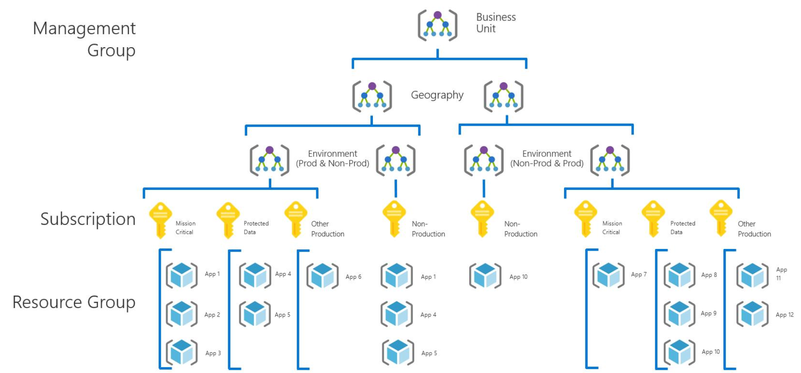

## Recursos de soporte técnico en Azure

- Documentación: Guías de introducción, SDK, herramientas, etc
- Vídeos de Azure Services
- Comunidad: ingenieros de MIcrosfot y expertos de la comunidad Azure.

## Recursos de facturación y gestión de suscripciones

- `Azure Quizckstart Center`: Una experiencia guiada en Azure Portal disponible para cualquier persona que quiera mejorar sus conocimientos de Azure.
- `Azure Service Health`: Proporciona información sobre los problemas relacionados con los servicios de Azure.
- `Azure Advisor`: Ofrece recomendaciones personalziadas sobre cómo optimizar el costo y el rendimiento.

## Planes de soporte

- `Basic`: Disponible para todas las cuentas como plan gratuito. Sin soporte activo. Acceso a Foros, documetnación, tickets de soporte.
- `Developer`: Recomendado para entornos de prueba o dev. Soporte activo mediante emails durante horario de oficna. Tiempo de respuesta: 8h
- `Standard`: Plan sugerido para entornos de producción. Soporte email y telf. Tiempo de respuesta: 1h. Soporte 24/7h
- `Profesional Direct`: Recomendado para entornos críticos. Soporte 24/7. Tiempo de respuesta: 1h. Soporte operativo, capacitación y soporte proactivo.
- `Premier`:

  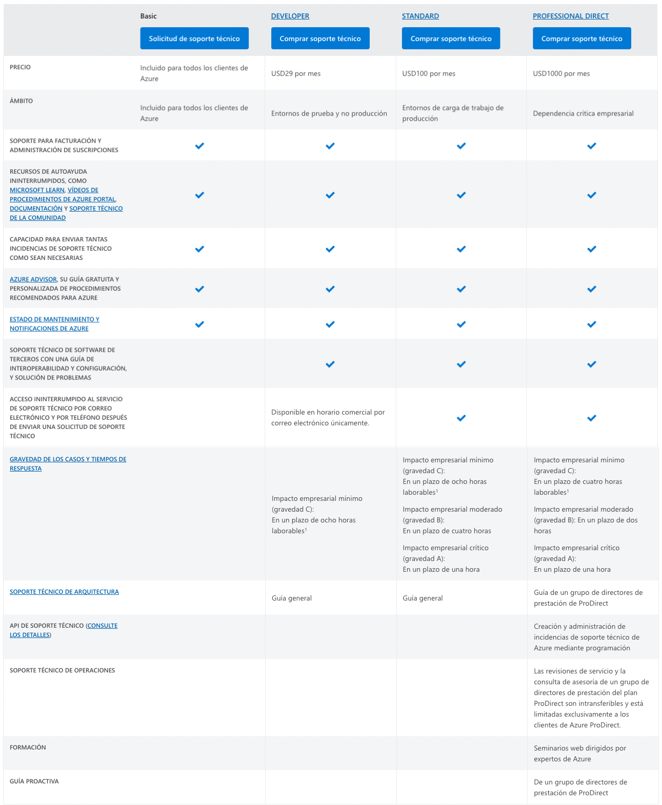

## Introducción a los servicios de AZURE

  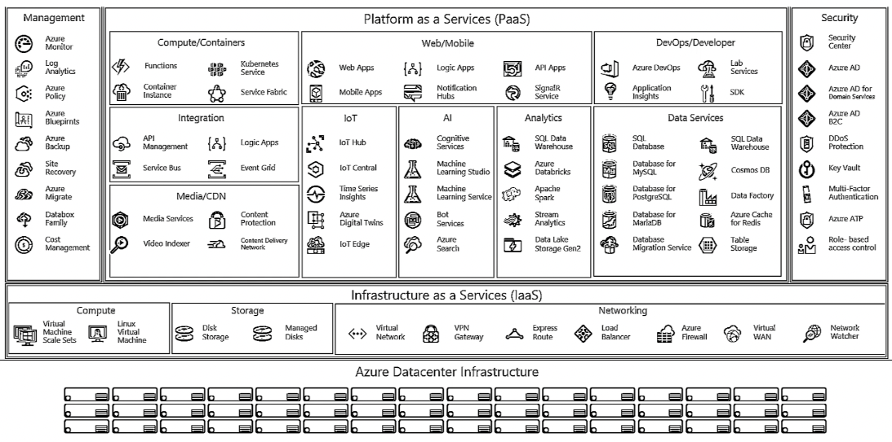

## Cómputo

- Maquinas vistuales (Windows o Linux)
- Virtual Machine Scale Sets
- Kubernetes Services
- Azure Service Fabric
- Azure Batch
- Instancias de contenedores: aprovisionar y ejecutar apps en aplicaciones
- Azure functions (serverless): servicio basado en eventos

  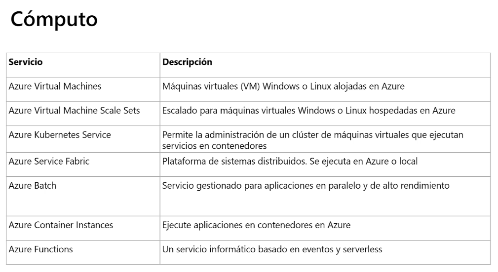

## Redes

  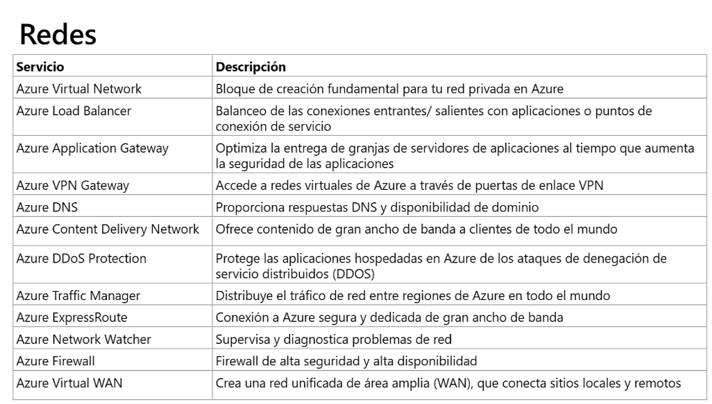

## Almacenamiento

  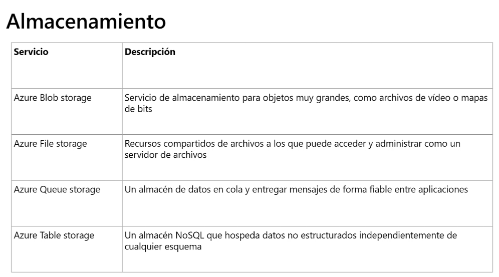

## Bases de datos

  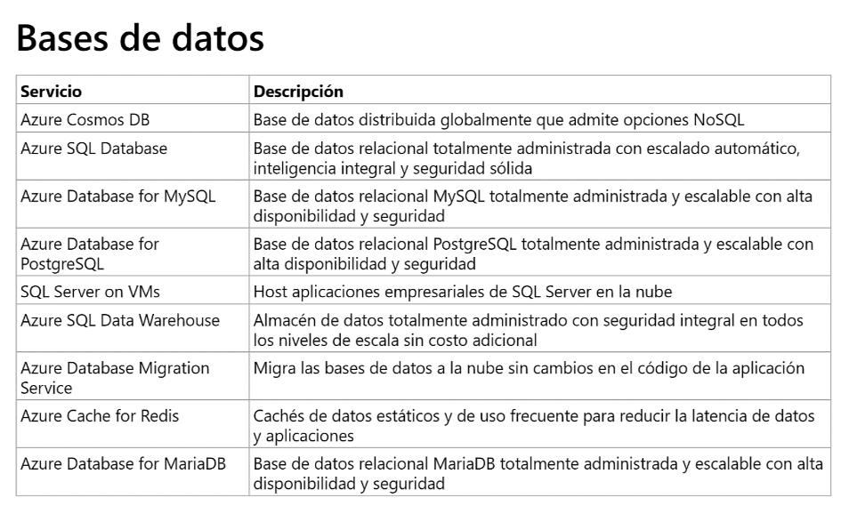

## Servicios Web

  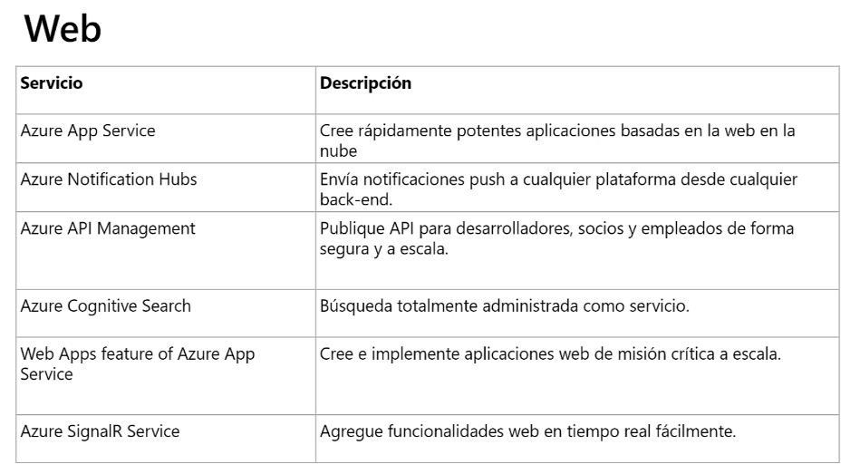

## IoT

  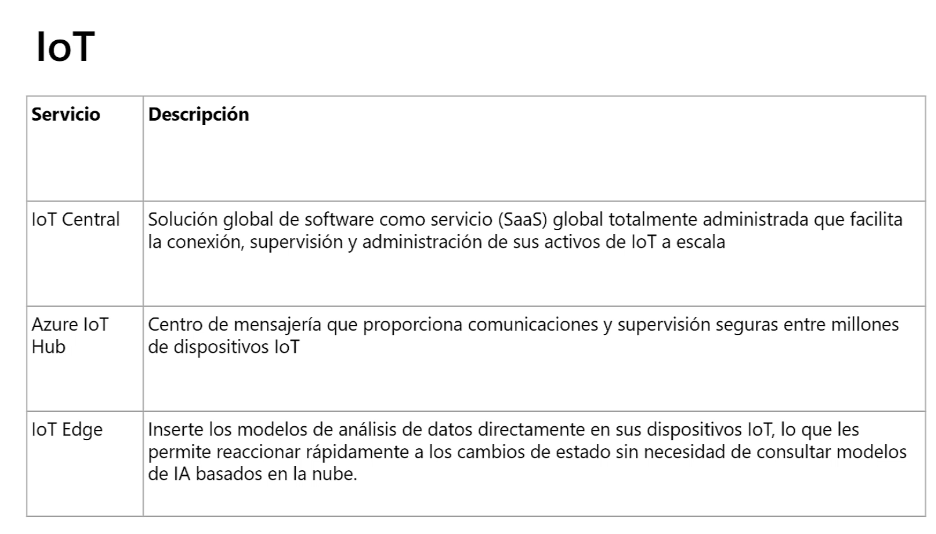

## Big Data

  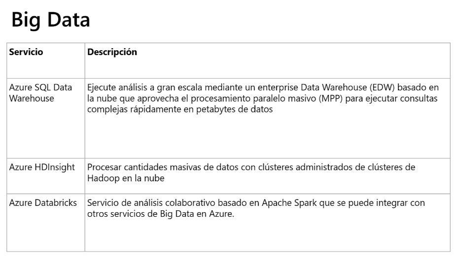

## Inteligencia Artifical

  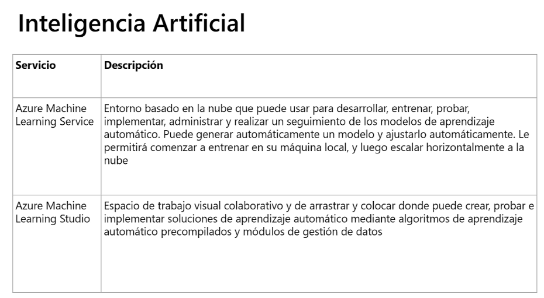

## Servicios cognitivos

  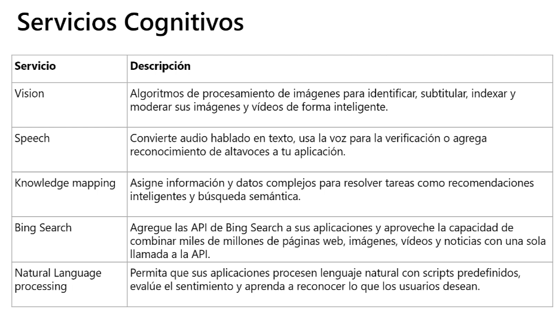

## DevOps

  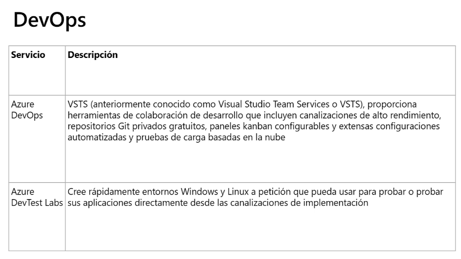

