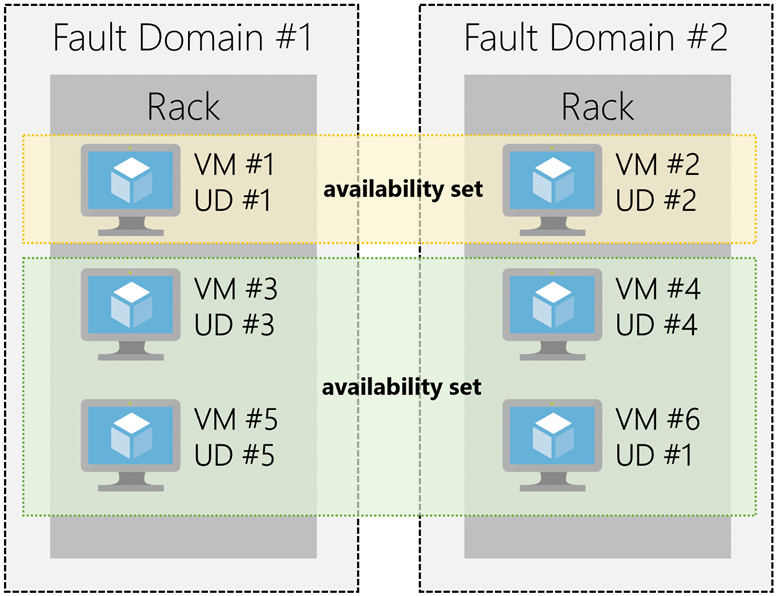
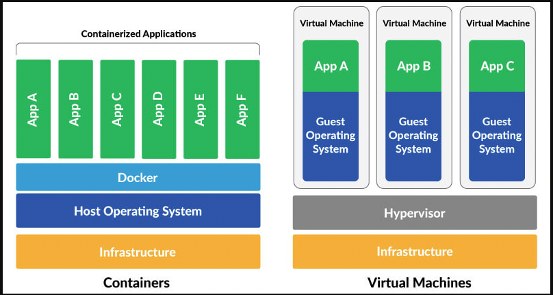
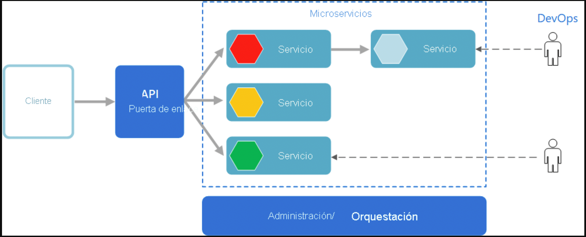

# Productos principales de Azure

- `Máquinas virtuales`: emulaciones de software de equipos físicos. Incluyen capacidad de procesamiento virtual, memoria de almacenamiento y recursos de red. Alojan un SO y permiten ejecutar software igual que en un PC.
- `Contenedores`: Entorno de virtualización para ejecutar aplicaciones. No incluyen el SO sino que agrupan las bibliotecas y componentes necesarios para ejecutar la aplicación y usar el SO HOST existe que ejecuta el contenedor.
- `App services`: oferta de plataformas como servicio diseñada para hospedar aplicaciones.
- `Serverless`: Entorno de ejecución hospedado en la nube que ejecuta el código pero abstrae el entorno de la infraestructura subyacente.

## Máquinas virtuales

Azure permite crear máquinas virtuales en la nube. Proporciona una infraestructura como servicio en forma de servidor virtualizado. Se trata de una emulación de software de un ordenador físico que dispone de:

- Procesador virtual
- Memoria
- Almacenamiento
- Recursos de redes

REVIEW: REVIEW

Es posible personalizar el software que se ejecuta en la máquina. Control total sobre el SO. Capacidad de ejecutar software personalizado. Configuraciones de hosting personalzaidas. Flexibildiad de la virtualziación sin necesidad de comprar hardware. ES necesario administrar la máquina (instalar, configurar y actualziar el software). Se tardan minutos en Azure si seleccionamos una imagen (plantilla que incluye SO, software de desarrollo, etc) de ma´quina virtual preconfigurada. Típcioas para ambientes de prueba o desarrollo. Forma rápida y sencilla de crear diferentes configuraciones de aplicaciones y SO.

Beneficios económicos. Extender capacidades de redes mediante una red virtual y añadir máquinas virtuales a dicha red.

Mover servidor físico a la nube creando una imagen del mismo y hospedándola en la máquina virtual.

El mantenimiento de la máquina virtual incluye actualizar SO y el software. Agrupar máquinas virtuales para proporcionar alta isponibilidad, escalabilidad y redundancia. Características:

## Conjuntos de disponbilidad o Availability Set

Agrupación lógica de dos o más máquinas virtuales que ayudan a mantener la aplicación disponible durante un mantenimiento planificado (parches, corregir vulnerabilidades, mejorar características, etc). Las actualziaciones sobre una máquina que forma parte de un conjunto de disponibilidad se hace de manera secuencial para que no todas las máquinas se reinicien al mismo tiempo.

Las máquinas virtuales se coloan en diferentes dominios de actualización o `update domamins` (parte lógica de cada centro de datos): indican grupos de maquinas virtuales y hardware físico subyacente que se peuden reiniciar al mismo tiempo. Los eventos de mantenimiento no planificados indican un error
de hardware en el centro de datos (corte de energía, error en disco, etc). En este caso se pasa automáticamente a un servidor físico donde la máquina virtual siga ejecutándose.

El grupo de máquinas virtuales que comparten hardware están en el mismo `fault domain`: rack de servidores. Separación física de carga de trabajo entrete diferentes hardware con alimentación, refrigeración y red. En caso de que un rack deja de estar disponible, solo esa parte se verá afectada.

En un conjunto de disponibilidad hay hasta 3 fault domains que tienen un rack de servidor con recursos de red y alimentación dedicados y 5 update domains que pueden llegar a ser 20.

Solo pagas por las máquians virtuales dentro del conjunto de disponibilidad.

  

## Conjuntos de escalado de máquinas virtuales (Virtual machine ScaleSets)

Crear y adminstrar un conjunto de máquinas virtuales idénticas con balanceo de carga. Adminstraar configurar y actualziar de forma centralaizada muchas ma´quinas virtuales para proporcionar aplicaciones de alta disponibildiad. Su numero peude aumentar o disminuri según demanda o pragramaciónd efinida.

## Azure Batch

programcmion de trabajos a gran escala y la capacidad de escalar cientos o miles de máquinas virtuales. Cuando se ejecuta el servicio Batch comienza un grupo de máquinas virtuales, instala aplicaicones y datos de prueba, ejecuta trabajos como tareas haya, identifica errores, realiza trabajo en cola y reduce el pull de maquinas según se completa el trabajo.

## Contenedores

Entorno de tiempo de ejecución modificado creado sobre un sistema operativo Host que ejecuta la aplicación. No usa virtualización por lo que no emplea recursos simulando un hardware virtual con un SO redundante. Son más ligeros. Respuesta rápida en demanda y error. Ejecutar varias instancias de una aplicación en un único equipo Host.

El orquestador de contenedores puede iniciar, detener y escalar isntancias de la aplicaión según sea necesario. Permite Docker. Varia smaneras de adminstrar: Azure container instances y Azure kubernetes service

  

## Azure container instances

Ejecución rpaida y sencilla de contenedores. Oferta de plataforma como servicio que permite subir contenedores y ejecutarlos con escalado autmatico.

## Azure kubernetes service

Servicio de orquestación : automatizar, adminstrar e interactuar con un gran número de contenedores. Los contenedores se emplean a menudo para crear soluciones mediante una arquitectura de microservicios (subdivisión de una solución en piezas pequeñas e independientes).

Escalado, mantenieminto y reemplazo de microservicos sin afectar a distintas partes de la aplicación.

Microservicio: Colección de servicios autçonomos y pequeños. independientes entre sí. Cada uno debe implementar una funcionaldiad de negocio individual.

  

## App services

Crear y hospedar aplicaciones web, trabajos en segundo plano, backend mobile, api rest full en diversons lengukjaes de progrmaación. Escaalado automatico y alta disponbilidad.

ADmite Windows y linuz.

Centrarnos en sitio web y logica mientras azure app services controla toda la infraestructura para ejecutar y escalar las aplicaciones web. El plan de App Services determina cuanto hardware se dedica al Host. Capa grautita para sitios web pequeños.

## Serverless

---

## SQL Manager Instance

Servicio de datos en la nube escalable que proporciona amplia compatibilidad del motor de bbdd con todos los beneficios de una plataforma como servicio completamente administrada. Motor de bbdd en plataforma como PaaS
